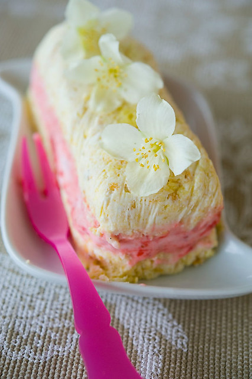

# Семифреддо с клубникой \| Semifreddo alle fragole

#### Ингредиенты:

на 4 порции

* 450 мл охлажденных свежих сливок \(жирность 32%\) 
* 100 г сахарной пудры 
* 70 г печенья савоярди 
* 1 стручок ванили 
* 150 г свежей клубники

#### Приготовление:

При помощи ножа разрезать стручок ванили вдоль и вынуть из него все содержимое. Клубнику помыть, обсушить на бумажных полотенцах и срезать плодоножку. Поместить две глубоких миски среднего размера в морозильную камеру. Печенье савоярди раскрошить руками, выложить на тарелку и перемешать с ванилью. 

При помощи миксера взбить охлажденные сливки с сахарной пудрой в густую и плотную массу и разлить по двум предварительно охлажденным мискам.

Одну миску поместить в холодильник на 20 минут, во вторую всыпать печенье и хорошо перемешать силиконовой лопаткой движениями снизу вверх.

Выстелить дно четырех формочек пищевой пленкой выложить в каждую небольшое количество сливок, смешанных с печеньем.

Поместить формочки в морозильную камеру на 10 минут, а оставшуюся смесь из сливок и печенья - в холодильник.

Тем временем измельчить клубнику в блендере до получения однородной массы и тщательно перемешать ее с охлажденными сливками из второй миски.

Достать из морозильной камеры формочки, распределить поверх сливок с печеньем клубничную смесь и снова поместить формочки в морозильную камеру.

Через 4 часа достать формочки, выложить поверх клубничного слоя оставшиеся сливки с печеньем и вернуть в морозильную камеру на 1 час.

Перед подачей достать формочки и погрузите дно каждой на 15 секунд в горячую воду. После этого сразу вынуть семифреддо из формы, удалить пленку, перевернуть на тарелку, подождать 3-4 минуты и подавать.

\_\_[_http://elladkin.livejournal.com/454041.html_](http://elladkin.livejournal.com/454041.html)\_\_

