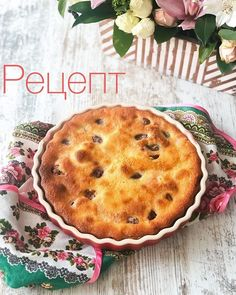

# Сливововый пирог от Поля Бокюза

#### Ингредиенты:

на форму 24 - 26 см

* 500 гр слив
* 120 гр муки
* 90 гр сахара
* ванильный экстракт
* 80 гр сливочного масла
* 40 гр молока
* 40 гр растительного масла без запаха
* 3 яйца
* 1 чл разрыхлителя
* 40 гр миндальной муки

на форму 16 см

* 220 гр слив
* 53 гр муки
* 40 гр сахара
* ванильный экстракт
* 35 гр сливочного масла
* 18 гр молока
* 18 гр растительного масла без запаха
* 1 яйцо
* 0,5 чл разрыхлителя
* 18 гр миндальной муки

  \*\*\*\*

#### Приготовление:

Сливы разрезать на половинки, вытащить косточки.

В миске смешать обычную муку, 2/3 сахара, разрыхлитель, молоко, растительное масло, ванильный экстракт. 2 яйца отдельно слегка взбить и добавить в мучную смесь.

Форму 24-26см для выпечки смазать сливочным маслом, присыпать мукой. Тесто вылить в форму. Сверху выложить сливы срезом вниз.

Выпекать 20 мин при 180С.

В это время растопить 80гр сливочного масла, снять с огня, добавить 30гр сахара, 1 яйцо и миндальную муку.

Вылить получившуюся смесь на пирог и отправить ещё на 15-20мин в духовку.

Пирог остудить. Лучше дегустировать слегка тёплым.

[_https://www.instagram.com/p/BnllZbbAp8N/_](https://www.instagram.com/p/BnllZbbAp8N/)

