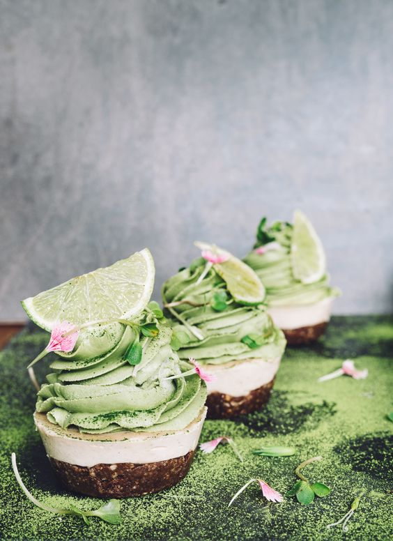

# Капкейки Матча-лайм

**Ингредиенты:**

на 10 капкейков

* 1 чашка сырого миндаля
* 1/2 стакана гречихи
* 5 фиников
* 1/4 стакана какао-порошка

**ванильный крем:**

* 2 чашки сырого кешью \(замочить на ночь\)
* 2 столовые ложки кленового сиропа
* 1/4 стакана миндального молока 
* 1/4 стакана кокосового масла
* 1 чайная ложка ванильной пудры

**крем матча - лайм:**

* 2 чашки сырого кешью \(замочить на ночь\)
* 4 столовые ложки кленового сиропа
* 2 столовые ложки порошка матча
* сок 1 лайма
* 1/4 стакана миндального молока
* 1/4 стакана кокосового масла

#### Приготовление:

Смешать миндаль и гречку, добавить финики и какао-порошок и снова смешайть. Переложить в миску, добавить 1 столовую ложку теплой воды и тщательно вымешать, пока смесь не склеится. Разделить на 10 формочек для кексов и плотно равномерно приать к дну \(использовать дно стакана\) Поместить формы в холодильник или морозильник, пока вы делаете следующий слой. Смешайте орехи кешью \(высушенные\), кленовый сироп, ванильный порошок и миндальное молоко до получения гладкой и кремовой массы \(необходим блендер с высоким содержанием пудры, такой как витамин, или много терпения при использовании обычного блендера\), добавьте кокосовое масло и снова смешайте. Смесь ложки через формы для кексов, разглаживать. \(это должно заполнить их\). Поместите формы в морозильник, чтобы установить. Чтобы сделать слой лайма, добавьте кешью \(слить\), кленовый сироп, миндальное молоко и сок лайма. После получения однородной массы добавьте порошок матча и кокосовое масло и снова смешайте. Выкопайте смесь в трубный мешок с широким / большим соплом. \(Вам не нужно делать причудливый вихрь, но он выглядит очень красиво!\). Поместите смесь в упаковочный пакет в миску и в холодильник, чтобы оставить на 4 часа. Извлеките пирожные из морозильника, налейте трубочный слой с матчем, чтобы сверху образовался большой вихрь, вернитесь в морозильную камеру и оставьте на ночь. Посыпьте дополнительным порошком матча и украсьте кусочками лайма и цветочными лепестками

