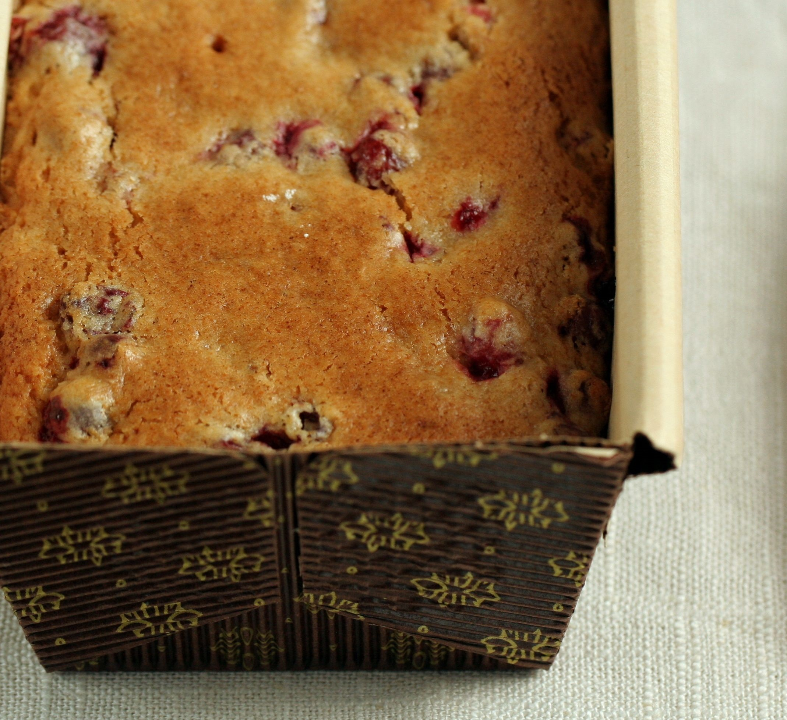

# Клюквенный кекс от Марты Стюарт

**Ингредиенты:**

на 2 небольших кекса

* 60 г сливочного масла \(растопить\)
* 240 г муки
* 200 г коричневого сахара
* 2,5 ч л пекарского порошка
* щепотка соли
* 1 крупное яйцо
* 180 г молока
* 350 г клюквы

#### Приготовление:

Взбить яйцо с сахаром, добавить растопленное сливочное масло и молоко.

Просеять муку с разрыхлителем и аккуратно добавьте в масляную смесь, перемешать, посолить.

Вымыть клюкву и откинуть на дуршлаг, дать стечь воде, а затем слегка присыпать клюкву мукой \(достаточно 1 столовой ложки\). Клюкву, обсыпанную мукой, добавить в тесто, перемешать, перелить тесто в форму для кексов. 

Выпекать 1 час - 1 час 15 минут при 180 градусах. Кекс остудить, присыпать сахарной пудрой

[_https://home-chef.livejournal.com/122788.html_](https://home-chef.livejournal.com/122788.html)

