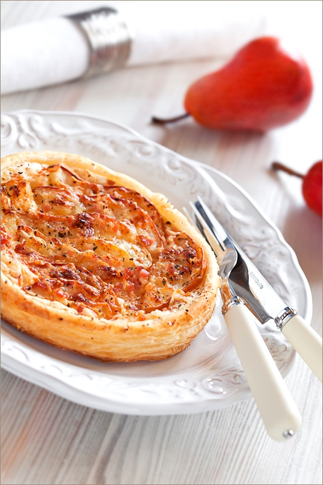

# Киш с грушей, голубым сыром и беконом

#### Ингредиенты

на форму 28 см

* твердая несладка я груша 2 шт
* голубой сыр 75 грамм
* грецкий орех или пекан 30 грамм
* жирные сливки \(30% и выше\) 100 мл.
* желтки 1 шт.
* 4 полоски копченого бекона

#### Приготовление

Груши очистить, удалить сердцевину. Нарезать на тонкие ломтики и сбрызнуть лимонным соком, чтобы не потемнели, бекон нарезать кубиками. Сливки соединить с желтком.

В выпеченную основу выложить грушу, кубики бекона, посыпать сыром и орехами, влить заливку.

Выпекать 15-20 минут при 180 градусах.

*laperla-foto.livejournal.com*

*vkusnyblog.ru*