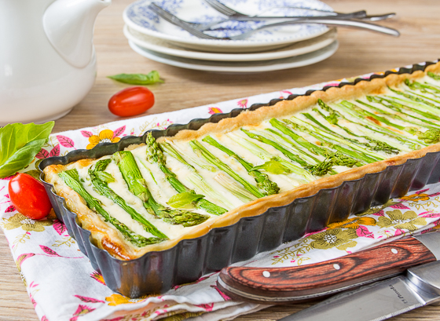

---
image: ../../pics/image.png
---
# Киш со спаржей и беконом

#### Ингредиенты

на форму 28 см

* 250 г  маскарпоне
* 60 мл густые сливки
* 3 яйца
* 50 г сыра Чеддер
* 250 грамм зеленая спаржа
* 60 г бекона
* 1/2 чайной ложки петрушки
* 1/4 чайной ложки соли
* 1/4 чайной ложки черный перец
* 1/4 чайной ложки мускатного ореха

#### Приготовление

С нижних частей спаржи овощечисткой счистить жесткую кожицу. Этот момент очень важен, иначе вам может быть не очень комфортно жевать пирог. Нарезать спаржу на кусочки или оставить целиком, если позволяет форма.

В миске смешать маскарпоне и густые сливки до образования кремовой массы. Добавить яйца и взбить. Добавьте в сливки бекон, специи и половину чеддера, хорошо перемешать.

Вылить начинку в выпеченную форму. Сверху выложить спаржу и оставшийся сыр.

Выпекать 35-20 минут при 180 градусах.

[_https://www.mypcoskitchen.com/low-carb-quiche-mascarpone-asparagus/_](https://www.mypcoskitchen.com/low-carb-quiche-mascarpone-asparagus/)

[_https://www.vkusnyblog.ru/recipe/pirog-so-sparzhej/_](https://www.vkusnyblog.ru/recipe/pirog-so-sparzhej/)
