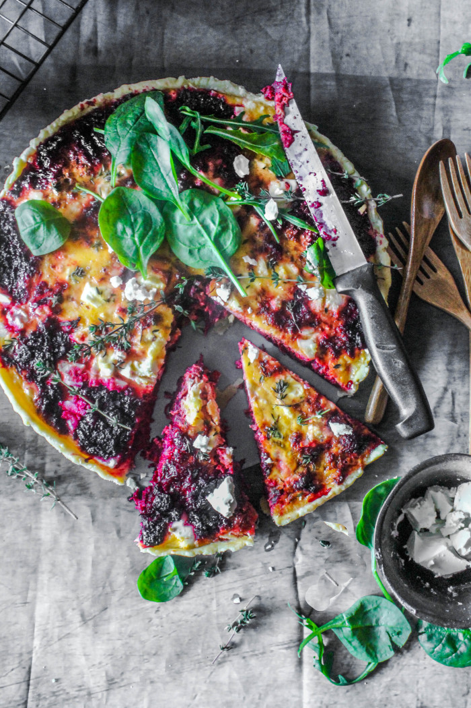

---
image: ../../pics/image5.png
---
# Киш со свеклой и фетой

#### Ингредиенты

на форму 28 см

* 2 больших свеклы \(около 400 г\)
* 1 ст. л. оливковое масло
* 1/4 стакана бальзамического уксуса
* 2 чайные ложки листьев тимьяна
* 1 столовая ложка коричневого сахара
* 150 гсыра фета
* 2 яйца
* 150 мл густых сливок

#### Приготовление

Нагреть масло на сковороде на среднем огне. Добавить свеклу, уксус, тимьян, коричневый сахар и 1 стакан воды, тушить помешивая 12-15 минут. Остудить.

Распределить смесь свеклы по выпеченной основе, сверху раскрошить сыр фета. Взбить яйцо со сливками и вылить в основу тарта, посыпать листиками тимьяна. Выпекать 35 минут.

Подавать с зеленым салатом

[_http://www.sugaretal.com/2014/07/09/beetroot-and-feta-tart/_](http://www.sugaretal.com/2014/07/09/beetroot-and-feta-tart/)
