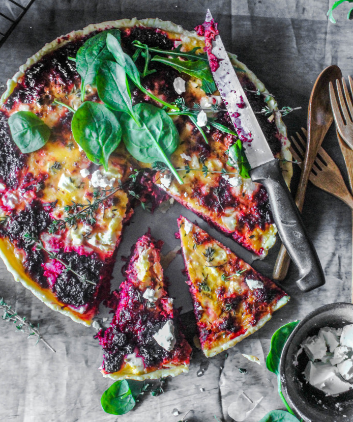

---
image: ../../pics/kish-so-svekloi-i-fetoi.png
---
# Киш со свеклой и фетой

#### Ингредиенты

на форму 24 см

* 2 свеклы \(около 300 г\)
* оливковое масло 1 ст л
* бальзамический уксус 40 г
* 3 свежие веточки тимьяна
* коричневый сахар 1 ст л
* фета 100 г
* 2 яйца
* сливки 100 мл

#### Приготовление

Нагреть масло на сковороде на среднем огне. Добавить свеклу, уксус, тимьян, коричневый сахар и 200 мл воды, тушить помешивая 12-15 минут. Остудить.

Распределить смесь свеклы по выпеченной основе, сверху раскрошить сыр фета. Взбить яйцо со сливками и вылить в основу тарта, посыпать листиками тимьяна. Выпекать 35 минут.

Подавать с зеленым салатом

*www.sugaretal.com*
