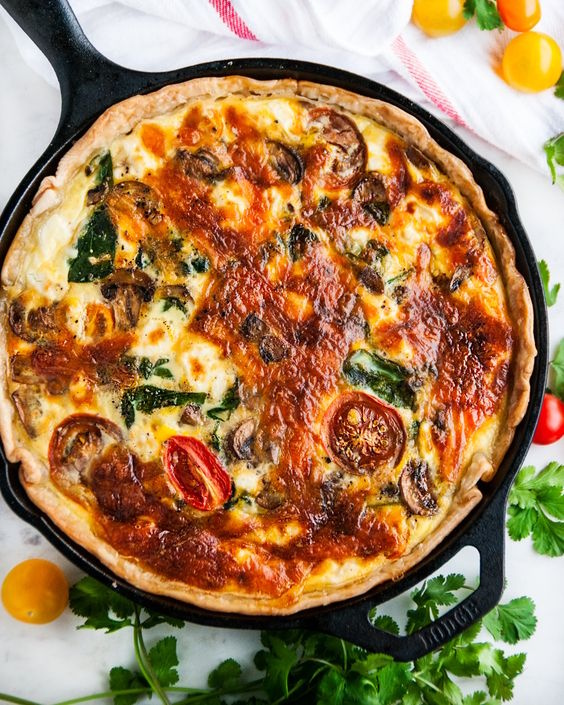

# Киш со шпинатом, грибами и томатами

#### Ингредиенты

на форму 28 см

* лесные грибы/шампиньоны/лисички 450 г
* свежий шпинат 400 г
* козий сыр 250 г
* помидоры черри 320 г
* чеддер 480 г
* куриное яйцо 4 шт
* молоко 700 г
* свежемолотый черный перец

#### Приготовление

Посыпать выпеченную основу тонким слоем тертого сыра чеддер.

В большой сковороде разогреть 2 столовые ложки оливкового масла на среднем огне, обжарить грибы 6-8 минут до мягкости. Добавить шпинат через 3-4 минуты, добавить соль и перец по вкусу.

Тщательно слить жидкость из грибов и шпината, выложить на основу. Сверху выложить 3/4 сыра фета и помидоры черри, нарезанные половинками.

Из молока и яиц приготовить чуть жидкий заварной крем и выложить сверху на начинку. Посыпать оставшимся сыром фета и чеддером сверху.

Выпекать 35-40 минут при 180 градусах.
