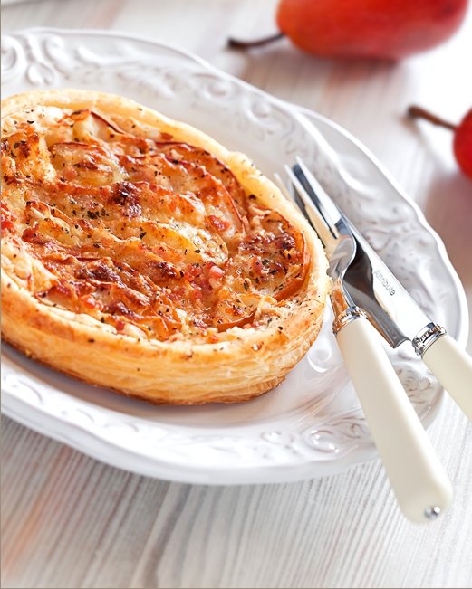

---
image: ../../pics/quiche-pear-bacon.png
---
# Киш с грушей, голубым сыром и беконом

#### Ингредиенты

на форму 24 см

* твердая несладкая груша 2 шт
* бекон или панчетта 70 г
* голубой сыр 50 грамм
* грецкий орех или пекан 20 грамм
* сливки 20% 200 мл.
* яйца 2 шт.

#### Приготовление

Груши очистить, удалить сердцевину. Нарезать на тонкие ломтики и сбрызнуть лимонным соком, чтобы не потемнели. Бекон нарезать кубиками, обжарить. Сливки соединить с яйцом, слегка взбить.

В выпеченную основу выложить грушу, кубики бекона, посыпать сыром и орехами, влить заливку.

Выпекать 15-20 минут при 180 градусах.
