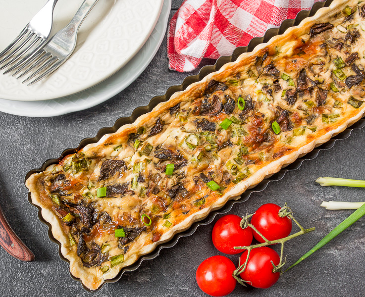

---
image: ../../pics/tart-s-gribami-i-syrom-1.jpg
---
# Тарт с грибами и сыром

#### Ингредиенты

на форму 28 см

* лесные грибы/шампиньоны/лисички 500 грамм
* твердый сыр 170 грамм
* яйца 4 шт.
* сметана 5 ст.л.
* чеснок 2 зубчикам
* щепотка мускатного ореха
* свежемолотый черный перец

#### Приготовление

Грибы разморозить.

В сковороде разогреть 1 ст.л. растительного масла, добавить грибы и жарить, помешивая, еще около 5 минут, снять с огня.

В выпеченную основу выложить начинку. Для заливки взбить яйца со сметаной и мелко натертым зубчиком чеснока.

Выпекать 35-40 минут при 180 градусах.

*vkusnyblog.ru*
