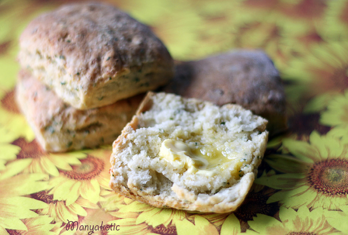

# Ирландские картофельные булочки

#### Ингредиенты:

на 12 булочек

* 225г муки
* 1 + 1\2 ч.л. разрыхлителя
* 50г масла, порезанного на кусочки
* щепотка соли
* 175г свеже-отваренного, размятого картофеля
* 1 ст.л. порезанного шнитт-лука 
* 200мл нежирного кефира

#### Приготовление:

Разогреть духовку до 220 С. 

Просеять муку и разрыхлитель, добавить кусочки масла и растереть. Посолить, добавить размятый картофель и порезанный лук, хорошо размешать и добавить кефира столько, сколько понадобится, чтобы тесто было мягким. 

На присыпанной мукой поверхности, тесто раскатать и порезать на 5 см квадраты. Выпекать примерно 20 минут.

\_\_[_https://world-cuisine.livejournal.com/105684.html_](https://world-cuisine.livejournal.com/105684.html)\_\_

