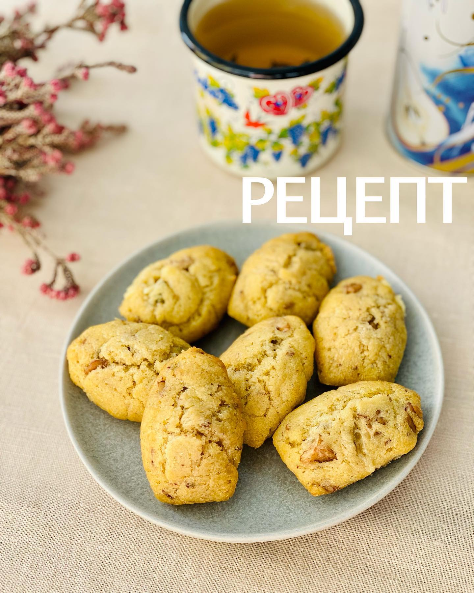

# Мадлен с грецким орехом и сыром с голубой плесенью

#### Ингредиенты

на 24 штуки

* 150гр муки
* 10гр разрыхлителя
* 60гр сливочного масла
* 220гр яиц (4-5 яиц)
* 60гр рокфора (или другого сыра с голубой плесенью)
* 80гр оливкового масла
* 2 щепотки соли
* 1 щепотка перца
* 75гр грецких орехов

#### Приготовление

Сыр и орехи мелко порубить. Масло сливочное растопить.  
Смешать яйца с сыром. Добавить муку с разрыхлителем, перемешать. Добавить сливочное масло, оливковое масло, соль, перец, орехи и хорошо перемешать.  
Отсадить тесто в формы при помощи кондитерского мешка.  
Поставить в нагретую до 210С духовку. Выключить. Через 4 минуты включить на 120С и выпекать 12 минут. Форму лучше ставить чуть выше среднего уровня в духовке.

[*@foodedlife*](https://www.instagram.com/p/CPvWCButcZw/)
