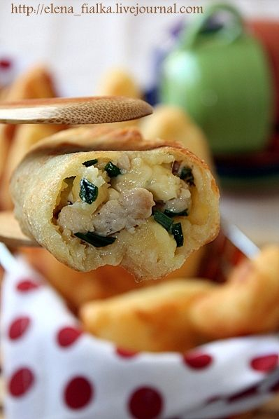

# Пирожки из творожного теста с курицей и сыром

#### Ингредиенты:

#### **для теста:**

* 250 г творога 
* 200 г муки +50 г на разделку теста 
* 2 яйца 
* 1 ч. л. соли 
* 2 ч. л. сахара 
* 1/2 ч. л. соды 
* растительное масло для жарки пирожков

**для начинки:** 

* 250 гр куриный фарш 
* 80 гр тертый на крупной терке сыр Гауда 
* 2 ст.л тертый сыр Пармезан 
* 20 гр сливочное масло 
* 4 ст.л зеленый лук 
* 0.5 ч.л молотый мускатный орех 
* Мельничка с 3-мя перцами\(розовый.черный,белый\) 
* Соль по вкусу

#### Приготовление:

В сковороде растопить масло, обжарить фарш в течении 5 минут,постоянно помешивая. Добавить перцы \(мельничка\), мускатный орех, немного посолить. Выключить газ. Добавить лук,сыры,перемешать.

Все ингредиенты для теста выложить в миску, замесить тесто. На разделочную поверхность насыпать 50 г муки, разделить тесто на равные части. 

Придать форму шариков, раскатать каждый шарик достаточно тонко, на присыпанной мукой поверхности. Положить на середину начинку, защипать края, сформировать пирожок продолговатой формы. 

Жарить пирожки в достаточном кол-ве растительного масла, выкладывать стороной с защипом вниз. Готовые пирожки положить на бумажные полотенца. 

[_http://elena-fialka.livejournal.com/59940.html_](http://elena-fialka.livejournal.com/59940.html)

