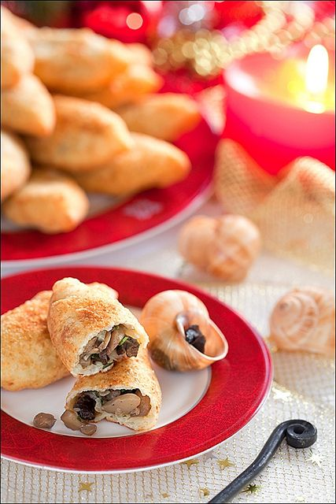

# Пирожки из творожного теста с шампиньонами и улитками

#### Ингредиенты:

#### **для теста:**

* 250 г творога \(9% жирности\) 
* 200 г пшеничной муки + 50 г для разделки теста
* 2 куриных яйца 
* 2 ч л сахарного песка 
* 1 ч л разрыхлителя 
* 1 ч л соли

**для начинки:** 

* 500 г шампиньонов 
* 125 г мяса консервированных улиток 
* 2 средние луковицы 
* 1 небольшой пучок петрушки 
* 3 ст л растительного масла
* свежемолотый черный перец 
* соль
* _можно добавить сыр, камамбер_

#### Приготовление:

Шампиньоны разрезать вдоль на 4 части и затем нарезать поперек. Лук мелко нарезать и пожарить до золотистого цвета в 3 ст л растительного масла. Добавить порезанные шампиньоны и жарить, помешивая, до тех пор, пока из них не выпарится лишняя жидкость.  
  
Мясо улиток нарезать, добавить к шампиньонам, перемешать, через 2 минуты снять сковороду с огня. Посолить и поперчить по вкусу, добавить измельченную зелень петрушки, перемешать.  
  
Все ингредиенты для теста выложить в миску, перемешать, замесить тесто руками или при помощи миксера. На рабочую поверхность насыпать 50 г муки, разделить тесто на равные части. Каждому придать форму шара, а затем раскатать каждый шарик достаточно тонко на присыпанной мукой поверхности. В центр положить начинку, защипать края, и сформировать пирожок продолговатой формы.  
  
Жарить пирожки небольшими порциями в достаточном количестве растительного масла на среднем огне. Для того, чтобы в процессе жарки пирожки не разваливались, лучше всего выкладывать их на сковороду швом вниз. __Готовые пирожки положить на бумажные полотенца.   
  
[_https://laperla-foto.livejournal.com/111261.html_](https://laperla-foto.livejournal.com/111261.html)\_\_

