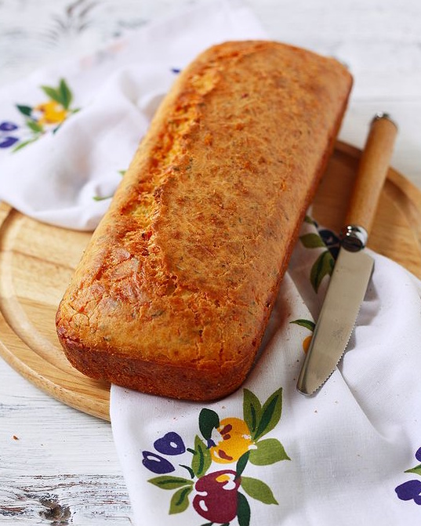
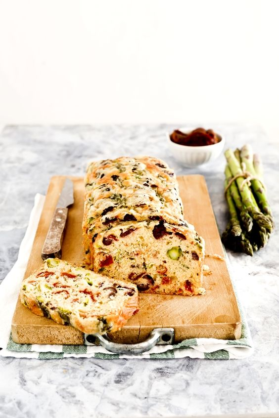
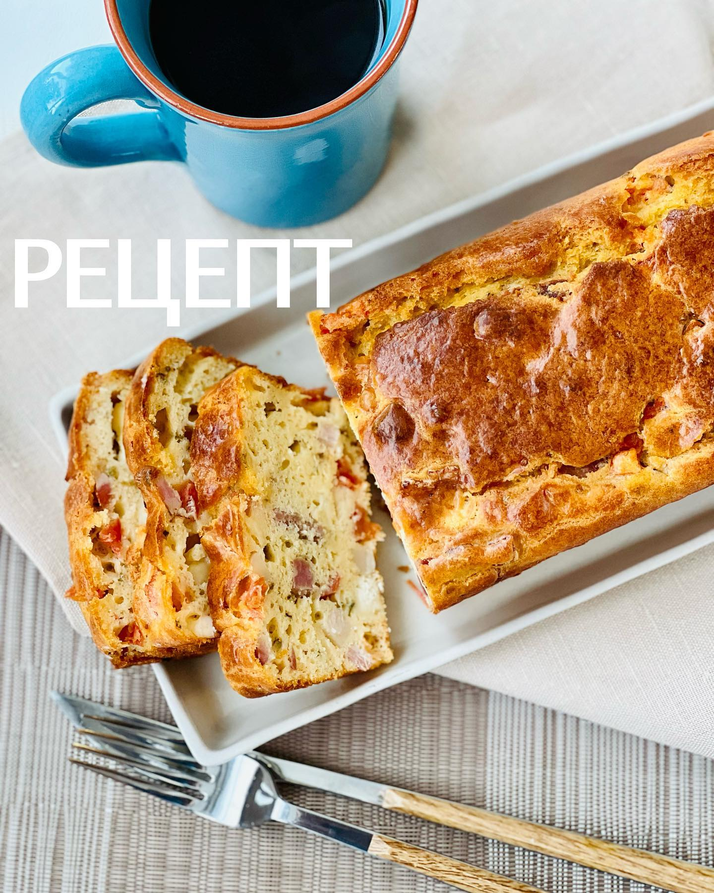
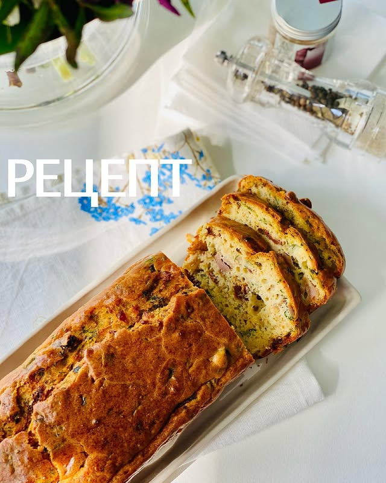

---
image: ../../pics/cake-savory-cheese.jpg
---
# Кекс с пармезаном, чесноком и ароматными травами

#### Ингредиенты

* мука 150 г
* 3 яйца
* молоко 100 г
* оливковое масло 90 г
* пармезан 100 г
* ароматные травы, сухой чеснок
* разрыхлитель 1 чл
* щепотка соли

#### Приготовление

Взбить венчиком яйца с молоком и маслом. Добавить муку, разрыхлитель, натертый сыр, чеснок, травы. Хорошо перемешать. Вылить тесто в форму для кекса. Выпекать при 170 градусах около 35-40 минут.

*elena-fialka.livejournal.com*

## со спаржей, вялеными томатами и оливками

##### Ингредиенты

* спаржа 250 г
* вяленые томаты 100 г
* горсть оливок

### Приготовление

Отварить свежую спаржу в кипящей подсоленной воде около 3 минут, она не должна сильно размягчиться, остудить по ледяной проточной водой, чтобы сохранить яркость цвета, обсушить. Отделить спаржу от жестких стеблей. Нарезанные оливки, спаржу и томаты вмешать в тесто.

*oggipanesalamedomani.it*

## с беконом и козьим сыром

##### Ингредиенты

* 1 козий сыр (Crottin)
* бекон или грудинка 200 г
* 1 помидор

### Приготовление

Помидор нарезать на 4 части, удалить зёрна с жидкостью, мякоть нарезать на кубики.  
Сыр нарезать кубиком.  
Бекон обжарить на сухой сковороде (если грудинка, нарезанную брусочками) и откинуть на бумажное полотенце.  
В тесто добавить помидор, бекон и сыр, аккуратно перемешать.

*Ig: foodedlife*

## с тунцом, вялеными томатами и травами

##### Ингредиенты

* тунец в собственном соку 250 г
* вяленые томаты 100 г
* петрушка 4 веточки
* тархун 4 веточки

### Приготовление

У тунца слить жидкость и размять вилкой. Томаты нарезать полосками. Траву мелко порубить. Всё смешать, добавить в тесто.

*Ig: foodedlife*