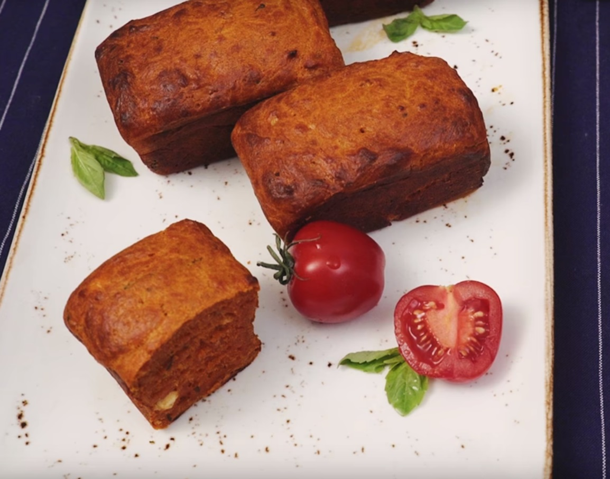

# Закусочный кекс с томатом и базиликом

#### Ингредиенты

на 1 форму 10\*20

* 2 яйца
* 100г мука
* 5г разрыхлитель
* 35г подсолнечное масло
* 65 г молоко
* 75 г фета
* 50 г пармезан
* 75 г томатная паста
* 1 ст л оливковое масло
* 2-3 веточки базилик
* 1 зубчик чеснок
* соль, перец

#### Приготовление

Промыть и высушить базилик и нарезать тонкими полосками

В сковороде на оливковом масле потушить томатную пасту, чтобы выпарить воду, 3-5 минут. Добавить базилик, фету и мелко порубленный чеснок. Снять с огня, добавить соль и перец, хорошо перемешать.

Слегка взбить яйца в отдельной миске. Просеять муку с разрыхлителем, тщательно смешать с яйцами. Прогреть молоко с подсолнечным маслом в микроволновке, добавить в тесто в 2-3 приема, хорошо перемешать.

Добавить натертый пармезан, затем добавить томатную массу и деликатно перемешать до однородности.

Выложить в формы, выпекать 20 - 25 минут при 180. Готовые кексы остудить 3 минуты в форме, подавать теплыми.

*Niksya*