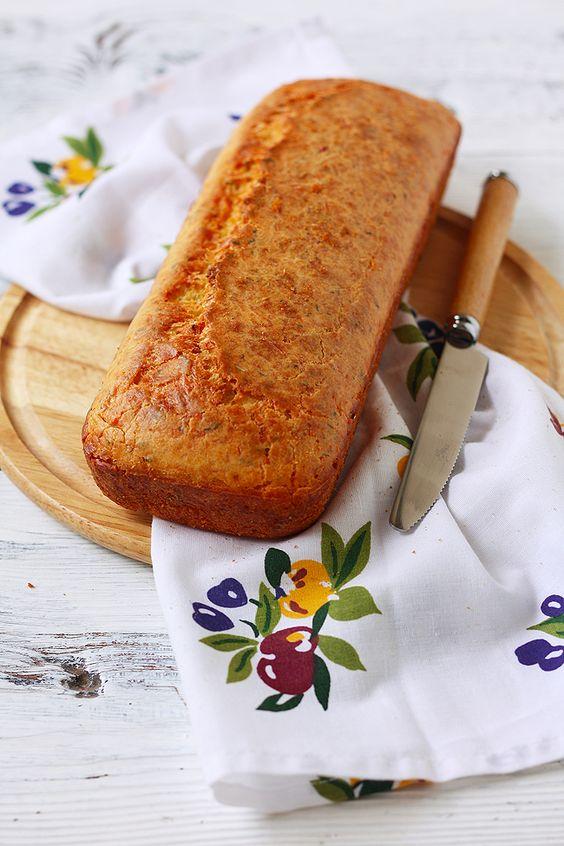
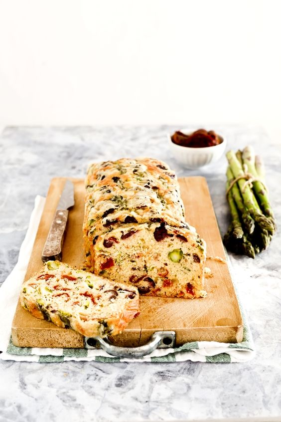

# Кекс с пармезаном, чесноком и ароматными травами

#### Ингредиенты

* 150 грамм муки
* 3 яйца
* 100 мл молока
* 100 мл растительного масла
* 100 гр тертого пармезана
* 1 большой зубчик чеснока
* ароматные травы
* 1 ч.л с горкой разрыхлителя
* щепотка соли

#### Приготовление

Взбить венчиком яйца с молоком и маслом. Добавить муку,разрыхлитель, сыр, чеснок, травы. Хорошо перемешать. Вылить тесто в форму для кекса. Выпекать при 170 градусах около 35-40 минут.

*elena-fialka.livejournal.com*

## со спаржей, вялеными томатами и оливками

##### Ингредиенты

* 250 г спаржи
* 100 г вяленых томатов
* горсть оливок сорта Gaeta

### Приготовление

Отварить свежую спаржу в кипящей подсоленной воде около 3 минут, она не должна сильно размягчиться, остудить по ледяной проточной водой, чтобы сохранить яркость цвета, обсушить. Отделить спаржу от жестких стеблей. Нарезанные оливки, спаржу и томаты вмешать в тесто.

*oggipanesalamedomani.it*
