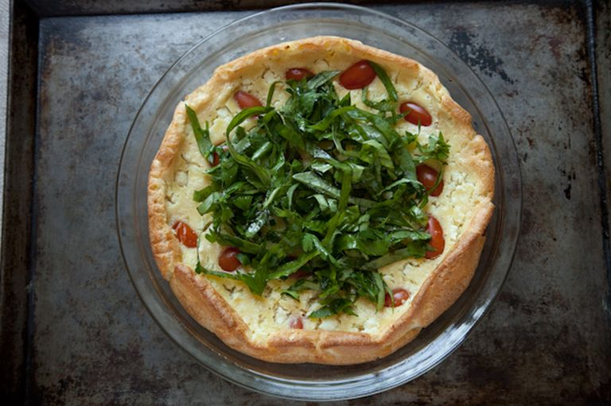

# Клафути с помидорами черри

#### Ингредиенты:

#### **для клафути:**

* 80 г молока 
* 3 яйца 
* 80 г сливок 
* 50 г муки 
* 1/2 чайной ложки соли 
* 1/4 чайной ложки свежемолотого черного перца 
* 12-14 помидоров черри 
* 55 г козьего сыра 

**для салата:** 

* 2 горсти свежего базилика
* 2 горсти свежей петрушки
* 3 столовые ложки свежего эстрагона
* 3 столовые ложки свежего зеленого лука
* оливковое масло 
* щепотка соли 
* черный перец

#### Приготовление:

Разогреть духовку до 180°С. Смазать керамическую или стеклянную форму для выпечки 

В большой миске смешать яйца, молоко и сливки. Добавить соль, перец и муку, взбить до однородности. 

Помидоры выложить в подготовленную форму, вылить сверху тесто, поспать козьим сыром. Запекать в духовке до тех пор, пока клафути не вздуется и слегка не подрумянится, около 30-35 минут. 

Приготовить салат из трав , подавать клафути с зеленым салатом. 

[_https://food52.com/recipes/344-cherry-tomato-clafoutis_](https://food52.com/recipes/344-cherry-tomato-clafoutis)

