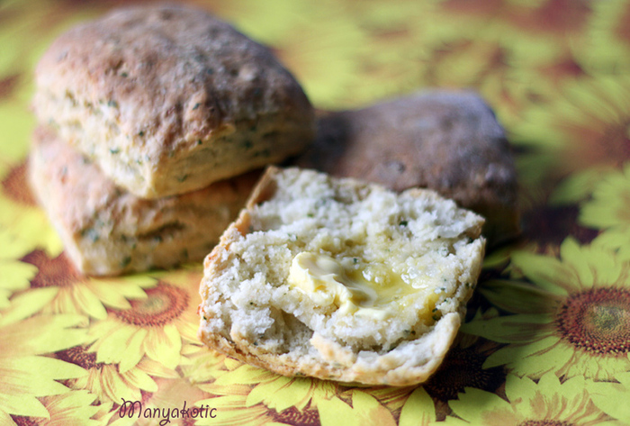

---
image: ../../pics/potato_buns.jpg
---
# Ирландские картофельные булочки

#### Ингредиенты

на 12 булочек

* мука 225 г
* разрыхлитель 1 + 1\2 ч л
* сливочное масло 50г
* щепотка соли
* картофель 175 г
* кефир 200 мл

#### Приготовление

Разогреть духовку до 220 С.

Просеять муку и разрыхлитель, добавить кусочки масла и растереть. Посолить, добавить размятый картофель и порезанный лук, хорошо размешать и добавить кефира столько, сколько понадобится, чтобы тесто было мягким.

На присыпанной мукой поверхности, тесто раскатать и порезать на 5 см квадраты. Выпекать примерно 20 минут.

*lg: world-cuisine*
