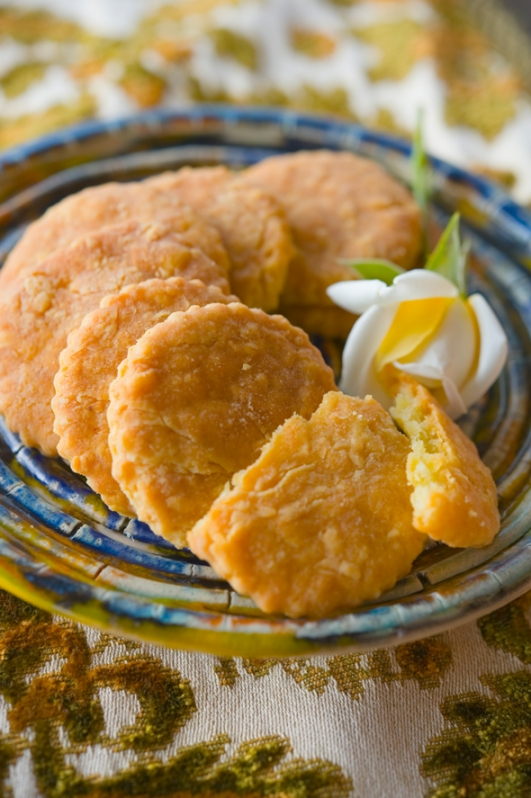

# Печенье с сыром \| Biscotti al formaggio

#### Ингредиенты

* 100 г просеянной муки из мягких сортов пшеницы (farina di grano tenero tipo «0»)
* 50 г тертого сыра пармезан
* 50 г тертого швейцарского сыра (например, эмменталь или родамер)
* 100 г размягченного сливочного масла
* 1 куриное яйцо
* соль

#### Приготовление

На стол просеять горкой  муку и смешать ее с сыром. В отдельную миску разбить яйцо и слегка взбить его венчиком.  
Сделать в центре горки углубление, добавить нарезанное кубиками сливочное масло, взбитое яйцо и щепотку соли. Быстро замесить  однородное тесто, стараясь использовать минимум муки.
Сформовать из теста шар, обернуть его пищевой пленкой и поместите в холодильник на 1 час.  

Духовку разогреть до 180°С.  
Охлажденное тесто освободить из пленки. Выложить  тесто на бумагу для выпечки и раскатать в пласт толщиной 0,5 см. Вырезать из пласта с помощью форм около 30 кружков.  
Выложить кусочки теста на выстеленный бумагой для выпечки противень и выпекать в предварительно разогретой духовке около 15 минут по светло-золотистого цвета.

[*https://www.ellamartino.ru/recipes/pechene-s-syrom-biscotti-al-formaggio*](https://www.ellamartino.ru/recipes/pechene-s-syrom-biscotti-al-formaggio)
