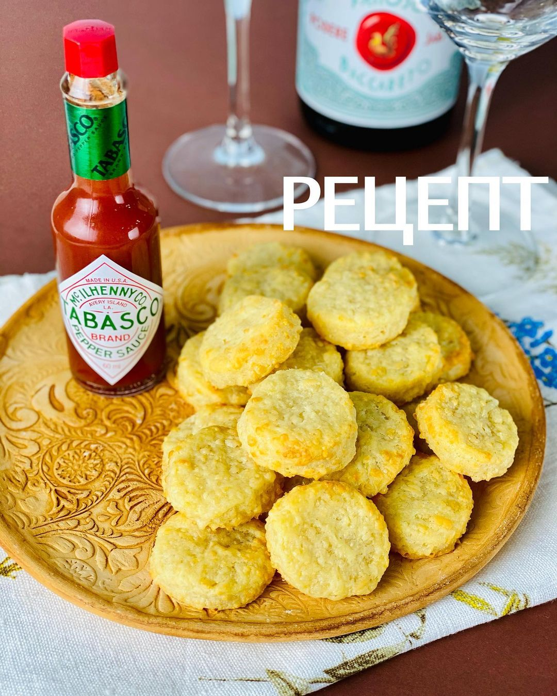

---
image: ../../pics/tabasco-cookies.jpg
---
# Сырное печенье с табаско

#### Ингредиенты

* 160гр муки
* 150гр тёртого сыра
* 100гр сливочного масла комнатной температуры
* 3стл сливок \(20-30%\)
* 0,5 ч л табаско
* хорошая щепотка соли
* 1 яйцо для смазки

#### Приготовление

Смешать все ингредиенты до однородности. Завернуть тесто в плёнку и отправить в холодильник на час-два.  
Раскатать тесто в пласт толщиной 0,5см. Вырезать фигуры произвольной формы. Смазать яйцом  
Выпекать при 180С 12-15 минут в зависимости от размера \(до лёгкого золотистого цвета\).

*ig: foodedlife*
