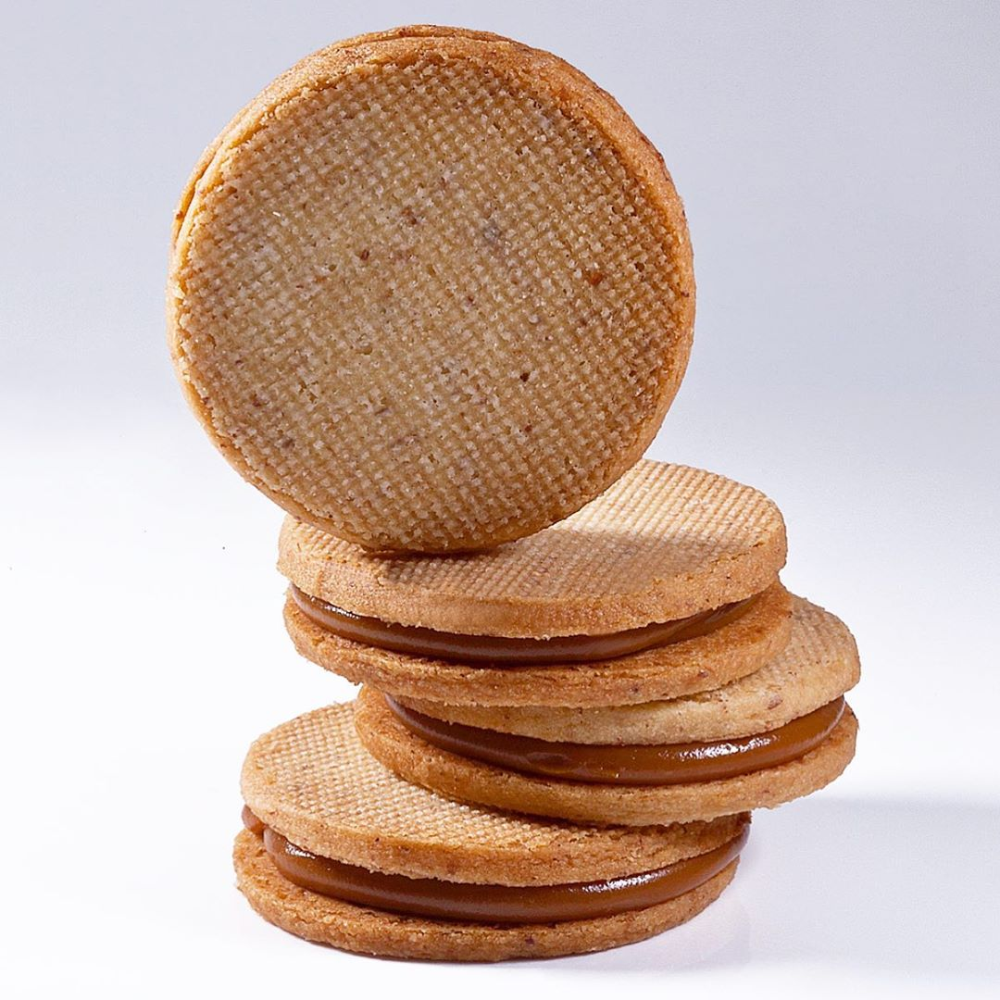

# Печенье alfajores

#### Ингредиенты:

* 400 г сливочного масла холодное, кубиками
* 100 г сахарная пудра
* 400 г муки 
* 100 г миндальной или фундучной муки или молотого ореха

#### Приготовление:

Разогреть духовку до 165 ° C. 

Смешать масло и сахар насадкой лопатка в миксере пока смесь не станет однородной. Добавить муку и ореховую муку и смешивать пока не сформируется шар. 

Раскатать тесто между 2 кусками пергаментной бумаги до толщины 2,5 мм. Накрыть полиэтиленовой пленкой и поставить в холодильник до готовности к использованию. 

Вырезать круглые печенья диаметром 6 см. Поместить на противень с перфорированным ковриком. Выпекать при 165 ° C в течение 15 минут. 

Остывшее печенье заполнить вареной сгущенкой

\_\_[_https://www.instagram.com/p/B\_xcixLl\_mM/_](https://www.instagram.com/p/B_xcixLl_mM/)\_\_

