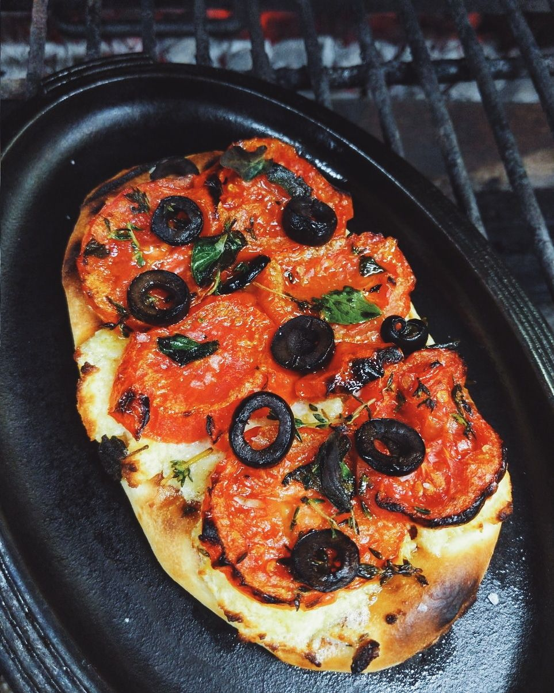

# Тесто для коки - каталонской пиццы

Во многих мировых кухнях есть аналог итальянской пиццы \(ну или почти аналог\). Вот и в Каталонии есть подобное блюдо, называется кока.

Разновидностей очень много: на нее кладут овощи, анчоусы, хамон, грибы, сардины, оливки. Причем сыр класть совсем необязательно.

Также есть сладкие вариации коки, самая известная, пожалуй, кока де Сан Жоан, которую готовят к празднику в июне. Сдобное тесто + цукаты и кедровые орешки сверху.

#### Ингредиенты:

на 12 небольших лепешек

* мука 500 г 
* соль 2,5 ч. л. 
* дрожжи сухие инстантные 1 ч. л. 
* вода 160 г 
* сливки 33% 120 г 
* молоко 120 г 
* сливочное масло 10 г

#### Приготовление:

Масло растопить, смешать с водой, сливками и молоком. Муку смешать с солью и дрожжами. Смешать все вместе и замесить тесто \(в миксере 8 минут крюком, руками минут 5, пока не будет достаточно эластичным\). Убрать в миску, накрыв пленкой. 

Через полчаса тесто нужно обмять. Смоченными руками взять тесто с одного края, вытянуть вверх и сложить поперек \(как бы пеленая\). Так раз 10 по кругу. Накрыть пленкой, через полчаса снова обмять. Через полчаса после этого можно катать лепешки.

Выложить тесто на посыпанную мукой поверхность, вытянуть в колбасу. Разделить на 12 кусочков по 70 г. Скатать шарики и дать им постоять минут 5. Раскатать скалкой \(размер как пита примерно, около 12 см\). 

Выпекать при 200-220 С, лепешка поднимается, внутри полость как у питы

_Лепешки можно заморозить. Слои проложить пергаментом, убрать в морозилку. На следующий день лепешки можно сложить в стопку и замотать пленкой. Доставать потом по одной и печь_

[_https://t.me/thatchickenstock_](https://t.me/thatchickenstock)

