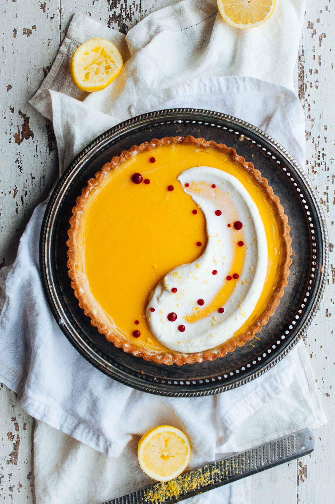

# Лимонный тарт с чаем Эрл Грей

#### Ингредиенты:

на форму 16 см

* основа для тарта

**для начинки:**

* 90 г густых сливок
* 3 г чая Эрл Грей
* 100 г яиц
* 20 г яичных желтков
* 140 г сахарного песка
* 125 г свежего лимонного сока
* цедра 2 лимонов

**для малинового геля:**

* 50 г малинового пюре
* 25 г сахарного сиропа 
* 50 г лимонного сока 
* 1 г агар-агара

**для шантильи:**

* 100 г жирных сливок 
* 10 г сахарной пудры 
* цедра 1 лимона
* 50 г пахты

#### Приготовление:

Для **лимонной начинки**

Сливки в маленькую кастрюлю, довести до кипения. Снять с огня, добавить чай, настоять 15 минут. Процедить сливки и взвесить - нужно добавить еще, до веса 90 г.

Смешать яйца, яичные желтки и сахар в миске, хорошо смешать венчиком. Добавить сливки, постоянно взбивая. Добавить лимонный сок и цедру, постоянно взбивая. Вылить в кувшин и сгладить погружным блендером  
  
Выложить основу в выпеченную форму, выпекать 45 минут при 180 

Выньте из духовки и остудить  
  
Для **малинового жидкого геля** смешать все ингредиенты в кастрюле и довести до кипения, постоянно помешивая. Варить 10 секунд, снять с огня и перелить в другую емкость. Дайте гелю остыть в холодильнике около 1 часа. Полностью остывший гель сгладить ручным блендером, переложить в мешок.

Для шантильи смешать густые сливки и сахарную пудру в миске миксера, взбивать до жестких пиков. Добавить цедру лимона и медленно добить пахту, взбивая на средней сорости. Взбить до средних пиков.

Для подачи выложить шантильи ложкой на поверхность тарта и нарисовать галочку. Из мешка выложить капли малинового сиропа

\_\_[_http://www.hintofvanillablog.com/home/2016/2/18/lemon-earl-grey-tart-with-buttermilk-chantilly_](http://www.hintofvanillablog.com/home/2016/2/18/lemon-earl-grey-tart-with-buttermilk-chantilly)\_\_

