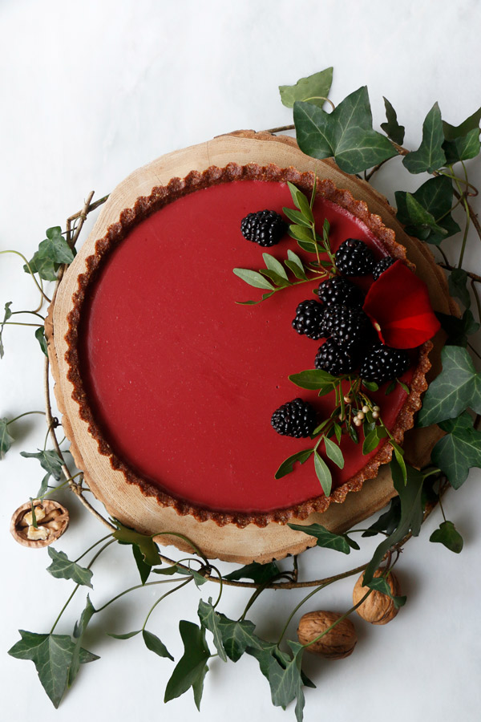

# Свекольный тарт с гибискусом

#### Ингредиенты:

на форму 16 см

* основа для тарта \(с 1/2 ч ложки корицы\)
* 80 г свеклы
* 1 ст ложки сухих цветов гибискуса
* 80 г сливок
* 1 ст л сахара
* ванильный экстракт
* цедра ½ апельсина
* 1 ст л апельсинового сока
* ½ ч л корица
* 1,5 ст л агара

#### Приготовление:

Свеклу очистить и нарезать кубиками, поместить в касрюлю, залить водой и варить под крышкой 30 минут до мягкости. Снять с огня , добавить гибискус и настоять 20 минут под крышкой. 

Свеклу и 30 мл настоянной воды измельчить в блендере до однородности, добавить сливки, ваниль, сахар, апельсиновую цедру, сок и корицу. Вылить в кастрюлю, добавить агар и довести до кипения, варить на низком огре 10 -15минут, постоянно помешивая, пока агар не растворится. Остудить до комнатной температуры.

Вылить в готовую основу для тарта. Поставить в холодильник на пол часа до застывания

Перед подачей украсить ягодами ежевики

\_\_[_https://nirvanacakery.com/beetroot-hibiscus-tart/_](https://nirvanacakery.com/beetroot-hibiscus-tart/)\_\_

