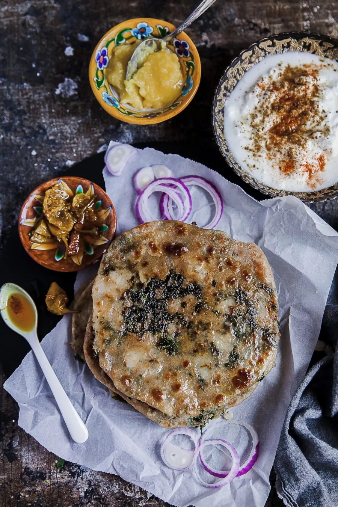

# Алу Парантха

"Алу" на хинди означает картошка. "Парантха" - лепешка.

#### Ингредиенты:

* 1 стакан муки грубого помола
* 1/2 стакана воды
* 2 небольшие картошки \(отваренные "в мундире"\)
* кинза
* зеленый жгучий перец  чили 
* соль
* гарам масала

#### Приготовление:

В миске смешать все сухие ингредиенты, постепенно понемногу добавлять воду, вымешивать пока не получится мягкое и пластичное тесто.

Оставить тесто отдохнуть, а в это время заняться начинкой. Картофель почистить размять в пюре, добавить соль, перец, порезать кусочками жгучий перец чили, добавить немного гарам масалы и мелко нарезанную кинзу или любую другую зелень по вкусу. Хорошо все перемешать.

Взять половину теста, раскатать его в небольшую лепешку в половину сковороды, не тонкую. Положить в центр немного картофельной смеси, собрать края теста наверху и защипнуть.

Немного придавить полученный шарик с начинкой рукой, чтобы получилась плоская лепешечка, обмакнуть в муке и раскатать в тонкую большую лепешку.

Выложить лепешку на разогретую сковороду без масла, обжарить лепешку на сухой сковороде с двух сторон. Затем еще раз обжарить лепешку с двух сторон, но уже смазав каждую сторону топленым сливочным маслом. 

Подавать с простоквашей.

[_https://www.playfulcooking.com/bread/potato-and-kale-paratha/_](https://www.playfulcooking.com/bread/potato-and-kale-paratha/)\_\_

\_\_[_https://ais20.livejournal.com/17098.html_](https://ais20.livejournal.com/17098.html)\_\_

