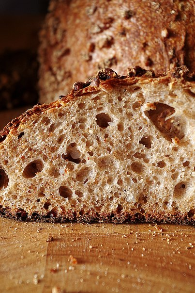

# Гречневый хлеб на закваске

#### Ингредиенты:

**для опары:**

* 100 гр. белой пшеничной муки
* 100 гр. воды
* 5 гр. стартера ржаного или пшеничного

**для**  **теста:**

* вся опара
* 250 гр. пшеничной цельнозерновой муки
* 50 гр. ржаной цельнозерновой
* 100 гр. белой пшеничной
* 200 гр. воды
* 100 гр. гречневой каши
* 20 гр. сахара
* 20 гр. меда
* 12 гр. соли
* 30 гр. растительного масла
* горсть вареной гречки для обсыпки

#### Приготовление:

В воде распустите закваску, добавьте муку, перемешайте, чтоб не было комочков, накройте и оставьте на 8-10 часов при комнатной температуре. 

Гречку замочить на ночь. 

Тесто замесить: смешать на первой скорости воду, муку и закваску, оставить на 15 минут, чтобы набухли белки муки, а также грубые частички цельнозерновой. Через 15 минут добавить гречку, соль и сахар и продолжить замес на второй скорости, в конце замеса добавить растительное масло. В общей сложности после аутолиза замес продолжался минут 15-17, тесто оставалось немного липким, но с ним вполне можно было работать. Сложить в шар и оставить подходить в миске, смазанной растительным маслом.

Ферментация около 2,5 часов. 

Готовое тесто выложить на посыпанный мукой стол, при желании разделите его на две части, округлите их дайте отлежаться минут 5-7. Потом сформуйте круглые или овальные заготовки, дно корзинок посыпьте мукой и вареной гречкой и уложите заготовки швом вниз. Расстойка около 2,5 часов.

Духовку я разогреть за час с камнем до 230. Первые 15 минут выпекать с паром, затем температуру снизить до 200 градусов, выпекать еще примерно 20 минут.

\_\_[_https://www.hlebomoli.ru/blog/grechnevyy-hleb-na-zakvaske_](https://www.hlebomoli.ru/blog/grechnevyy-hleb-na-zakvaske)\_\_

