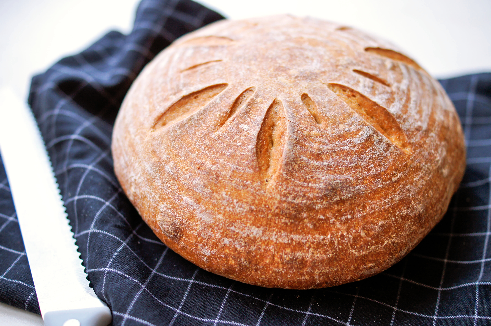

# Кукурузный хлеб на закваске

#### Ингредиенты:

**для**  **теста:**

* 100 г кукурузной муки 
* 100 мл кипятка 
* 400 г пшеничной муки 
* 230 г воды \(лучше холодной\) 
* 80 г пшеничной закваски 
* 10 г соли
* травы

#### Приготовление:

Заварить кукурузную муку кипятком, перемешайть и остудить. 

Смешайть все, кроме соли, и оставить на 30 минут для аутолиза. Через полчаса добавить соль и вымесить тесто до гладкости. Поместить в миску и оставить на ночь при комнатной температуре.

Утром подпылить кукурузной мукой стол, сформировать тесто в шар. Оставить отдохнуть на 30 минут, затем сформовать окончательно и оставить на 2 часа. 

Разогреть духовку до 240С с камнем. Выпекать 10-15 минут с паром, опустить температуру до 220С и выпекать еще 30-35 минут. 

[_https://t.me/feedthebitch_](https://t.me/feedthebitch)

