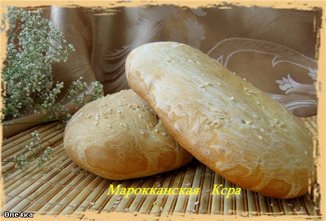

# Марокканская Ксра

#### Ингредиенты:

* 200 мл воды 
* 250 гр белой хлебной муки 
* 75 гр манки 
* 5 мл анисовой настойки 
* 1 1/2 ч.л. соли 
* 1/2 ч.л. сахара
* 1 ч.л. быстрых сухих дрожжей 
* оливковое масло 
* кунжутные семечки для посыпки

#### Приготовление:

Развести дрожжи в маленьком количестве воды с сахаром и смешать с остальными продуктами. Вымесить тесто. 

Разделить тесто на две или четыре части, скатать шарики и руками размять в лепешки, толщиной примерно 2 см. Переложить на противень. 

Покрыть пленкой смазанной маслом и дать подойти в течении 30 минут или пока лепешки не увеличатся. 

Нагреть духовку до 200С. Смазать каждую лепешку оливковым маслом, посыпать кунжутными семечками и наколоть лепешки вилкой. Печь 20-25 минут или до золотистого цвета. Лепешки при постукивании по ним пальцами должны издавать "пустой" звук.

\_\_[_https://world-cuisine.livejournal.com/31643.html_](https://world-cuisine.livejournal.com/31643.html)\_\_

