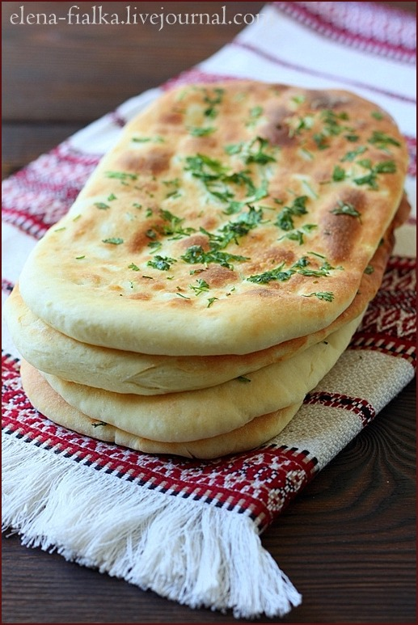

# Naan - индийские лепешки

#### Ингредиенты:

* 4 ст. мука
* 1 ч.л разрыхлитель
* 1/2 ч.л соль 
* 2/3 ст. натуральный йогурт 
* 1 взбитое венчиком яйцо 
* 2 ст.л топленого масла 
* 2/3 ст. теплое молоко 
* 2 ст.л сухие дрожжи 
* 2 ст.л сахар 
* зелень мелко-рубленая 
* 1/2 ст топленое масло для смазки

#### Приготовление:

Дрожжи, сахар и молоко 2/3 ст, смешать вместе и оставить на 20 минут

Муку просеять вместе с пекарским порошком, солью,в середине сделать углубление, добавить поднявшиеся дрожжи, добавить йогурт, топленое масло, яйцо, замесить тесто. 

Смазать чашку и тесто топленым маслом, прикрыть полотенцем, оставить на 2 часа в теплом месте. После стол обильно посыпать мукой, вымесить тесто около 5 минут. Разделить тесто на 8 равных частей, каждую часть скатать в шар, каждый шар раскатать в круг, после руками, вытягивая тесто придать ему форму овала, так поступить с каждой лепешкой. 

Противень смазать топленым маслом, положить лепешки, сверху кисточкой помазать каждую лепешку топленым маслом, посыпать рубленой зеленью. 

Выпекать в разогретой духовке при температуре 250 гр, примерно 10-15 минут, до того как лепешки станут светло-золотистого цвета

_elena-fialka.livejournal.com_

