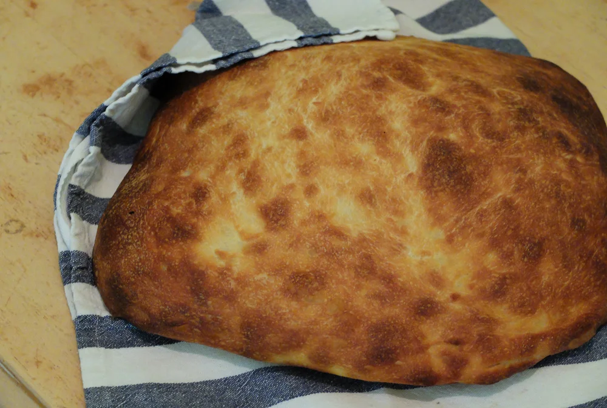

# Pan de cristal

Этот хлеб придумали пара предпринимателей в Барселоне лет 10 назад. Несмотря на то, что название хлеба запатентовано, вы без труда найдёте пару десятков рецептов пан де кристаля в интернете, и все они будут объединены тонкой, ломкой как стекло, коркой, нежным хорошо открытым мякишем, чуть влажным и тягучим. Конечно, корка сохраняется только первое время, затем от остывает и смягчается.

#### Ингредиенты:

* 410 г воды
* 45 г воды
* 510 г муки
* 10г соли
* 2 г инстантных дрожжей
* 25 г оливкового масла

#### Приготовление:

Смешать 410 г воды\(остальную оставить в отдельной миске\), дрожжи и муку. Перемешать до однородной влажности и оставить для автолиза на 30 минут. 

Через 30 минут добавить остатки воды с солью и маслом. Перемешать до однородности и оставить в миске под пленкой подниматься в течение 4 часов. Его нужно складывать мокрой рукой прямо в миске каждые полчаса после первого часа, после последнего складывания убрать его в холодильник. 

Достать, вывалить на пергамент, щедро присыпанный мукой, посыпать мукой сверху, растянуть. Толщина хлеба должна быть около 4 см перед расстойкой. Когда тесто выложено, слегка примять его кончиками пальцев, чтобы самую малость сдуть. 

Накрыть полотенцем и дать расстояться ещё час, после чего поставить в разогретую до 210 С духовку и выпекать в течение 30 минут.

[_https://zen.yandex.ru/media/id/5b863dc047174c00aab19ba6/pan-de-cristal-5c51c9400e369100ada9650f_](https://zen.yandex.ru/media/id/5b863dc047174c00aab19ba6/pan-de-cristal-5c51c9400e369100ada9650f)

