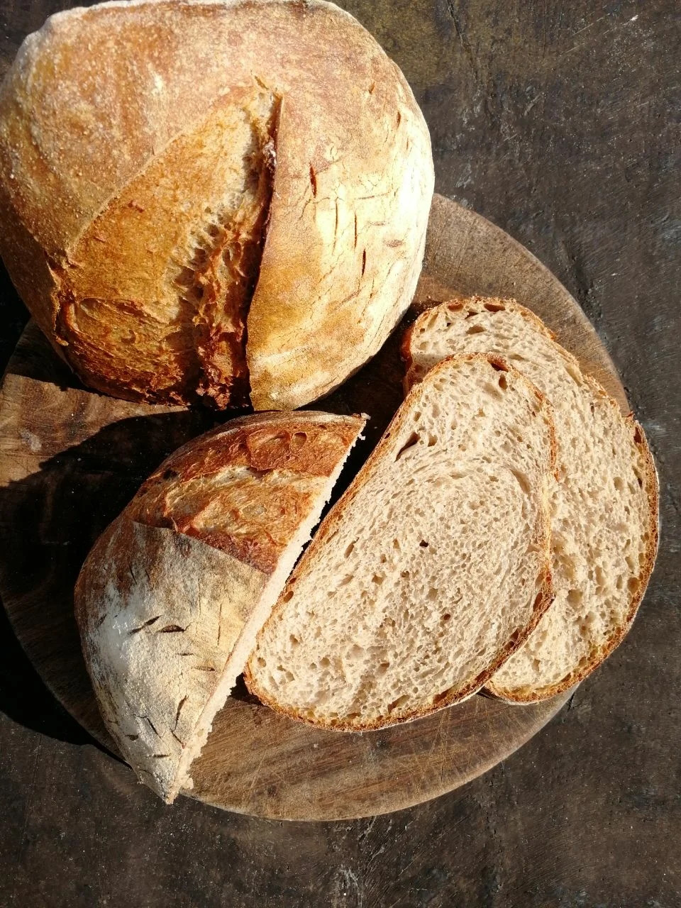

# Серый хлеб на закваске

#### Ингредиенты:

**для опары:**

* 25 г ржаной закваски
* 75 г пшеничной муки
* 100 мл холодной воды

**для**  **теста:**

* вся опара
* 375 г пшеничной муки
* 150 г ржаной муки
* 350 г воды

#### Приготовление:

Опару поставить поставить за 6-8 часов до замеса теста, например, в обед. 

Замесить, дать расстояться 4 часа, складывая каждый час после первого часа. 

После последнего складывания дать постоять полчаса, сформовать батон или буханку и убрать в холодильник в миске или корзине с полотенцем. 

Утром \(часов через 12-14\) надрезать и отпечь 10 минут в 230℃ и 30-40 минут при 210℃.

[_https://t.me/feedthebitch_](https://t.me/feedthebitch)\_\_

