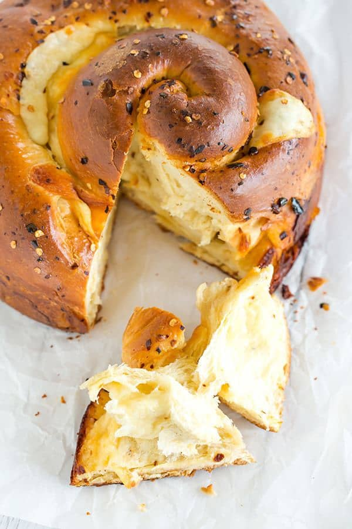

# Spicy Cheese Bread \| Пряный сырный хлеб

#### Ингредиенты:

на форсу 22 см

* 400г универсальной муки
* 50 г сахарного песка
* 1 ст л сухих дрожжей
* 1,5 ч л хлопьев красного перца
* 1¼ ч л соли
* 125 мл теплой воды (40C)
* 2 яйца
* 1 яичный желток
* 45г несоленого сливочного масла
* 170 г полутвердого сыра
* 170 г сыра проволоне или моцарелла
  
**для топпинга:**
* 1 яйцо
* 1 ч л хлопьев красного перца
* 1 ст л несоленого сливочного масла

#### Приготовление:

В чаше стационарного миксера смешать муку, сахар, дрожжи, хлопья красного перца и соль. В мерном стакане для жидкости смешать теплую воду, яйца, яичный желток и растопленное сливочное масло. Добавьте яичную смесь к мучной смеси в миске, вымесить 4-8 минут.

Сформировать из теста шар и переложить в смазанную маслом миску, расстоять 1,5–2 часа.

Раскатать тесто в прямоугольник, распределить сыр, нарезанных кубиками, оставляя 1-дюймовую границу по краям. Свернуть в рулет, защипнуть, раскатать в длину, свернуть в улитку.
Выложить в смазанную маслом форму и расстоять 1–1,5 часа.

Разогреть духовку до 190С.

Смазать верх буханки взбитым яйцом, посыпать хлопьями красного перца. Выпекать 25 минут до золотистого цвета. Затем накрыть фольгой и выпечь еще 25-30 минут.

Вынуть и сразу смазать размягченным сливочным маслом. Остудить в форме 10 минут, затем 30 мин на решетке.

*https://www.browneyedbaker.com/spicy-cheese-bread/*
