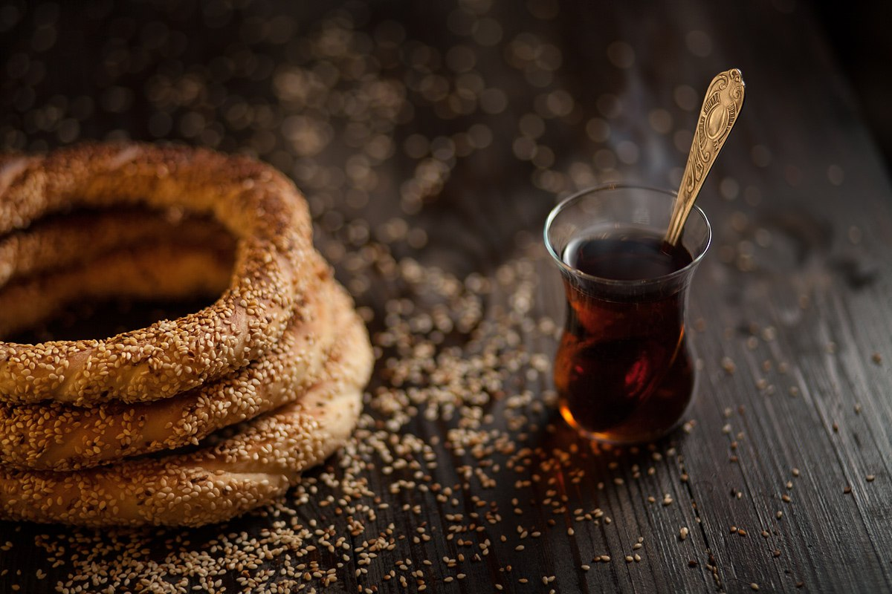

# Турецкие симиты

#### Ингредиенты:

на 4 больших бублика

* 250 г муки
* 10 г сахара
* 15 г оливкового масла
* 120 г теплой воды
* 0.5 чайной ложки соли
* 3 г сухих инстантных дрожжей
* примерно 1 стакан кунжута

#### Приготовление:

Для теста просеять в миску примерно ¾ всей необходимой по рецепту муки, добавить соль, сахар, дрожжи, все перемешать. 

Постепенно добавляя теплую воду, замесить тесто средней консистенции – не очень мягкое, но и не плотное, не прилипающее к рукам и стенкам посуды. При необходимости можно вмесить в тесто дополнительную муку \(из общей нормы\). В подготовленное тесто вмесить оливковое масло. Вмешивать масло малыми порциями, каждую последующую только после того как вмешана предыдущая. Тесто хорошенько вымесить, параллельно вбивая в тесто оставшуюся муку до густого, плотного, но хорошо вымешанного теста. 

Тесто округлить, положить в миску, накрыть влажным \(смоченным в воде и хорошо отжатым\) полотенцем и оставить в тепле на 20 – 30 минут. 

Обжарить кунжут до светло-золотистого цвета. Обжаривать на сухой сковородке, помешивая, и обязательно следить, чтобы не подгорел, поскольку излишне зажаренный кунжут будет горчить.

Тесто разделить на 4 равные части. Каждую часть сначала скатать в плотный шарик, а затем слегка раскатать, чтобы получилось что-то наподобие цилиндра. Подкатанное тесто сложить в миску, накрыть влажным полотенцем и оставить еще на 10 – 15 минут. 

Тесто смазать оливковым маслом, накрыть и оставить еще на 10 – 15 минут. 

Каждый кусочек теста раскатать в однородный по толщине жгут длиной 80 – 100 см. Сложить пополам, перевить и закрепить, чтобы получился витой бублик. Сформированные бублики окунуть в холодную воду \(можно использовать воду с медом\), а затем обвалять в кунжуте. Очень часто бублики перед обваливанием окунают не в воду, а в разведенную водой патоку \(pekmez\). В этом случае в тесто при замесе практически не кладут сахара – буквально щепотку.

Выложить бублики на противень, застеленный бумагой для выпечки. Противень поставить в слегка теплую духовку \(около 35 С\) на 20 минут, а затем переставить на стол и расстоять при комнатной температуре еще около 20 минут. 

Выпекать в хорошо разогретой до 250 С духовке 8 – 9 минут до румяности.

[_https://world-cuisine.livejournal.com/378895.html_](https://world-cuisine.livejournal.com/378895.html)

