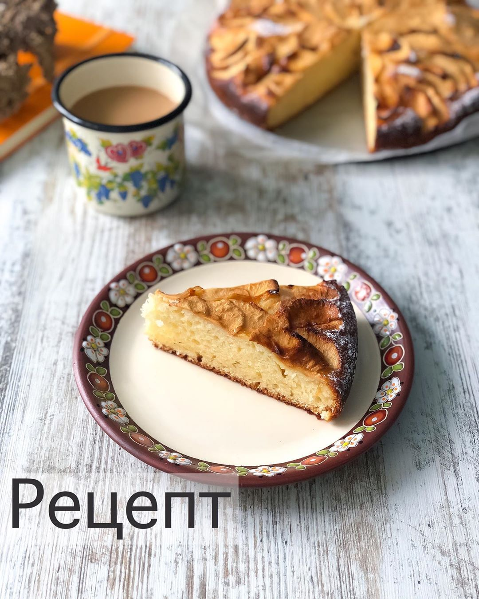

# Яблочный пирог на йогуртовом тесте

#### Ингредиенты:

на форму 28 см

* 240гр йогурта
* 180гр сахара 
* 2 яйца 
* 80гр растительного масла без запаха 
* 220гр муки 
* 10гр разрыхлителя \(1 пакетик\) 
* 3 яблока для украшения
* яблоки для начинки
* сахарная пудра

#### Приготовление:

Сахар взбить с яйцами добела, добавить йогурт и масло. Перемешать до однородности. Добавить муку с разрыхлителем. 

Вылить полувину теста в смазанную маслом форму, выложить мелко нарезанные яблоки, вылить оставшееся тесто. 3 яблока очистить и тонко нарезать, выложить сверху на тесто. 

Выпекать при 180С минут 45-50. За 10 минут до готовности посыпать сверху сахарной пудрой и продолжить выпекать.

[_https://www.instagram.com/p/B29CWN9F5Ik/_](https://www.instagram.com/p/B29CWN9F5Ik/)

