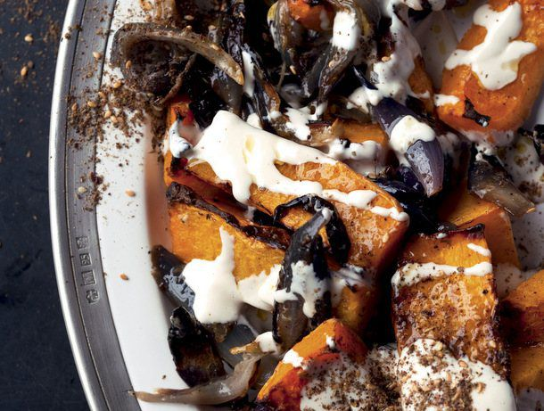

---
image: ../pics/butternut-tahini.jpg
---
# Тыква с тахини и заатаром

###### Ингредиенты

* тыква 1 кг
* оливковое масло 3,5 ст л
* тахини 3 ст л
* лимонный сок 3 ст л
* вода 2 ст л
* 1 зубчик чеснока
* кедровые орехи 30 г
* заатар 1 ст л
* петрушка 1 ст л
* соль, черный перец

#### Приготовление

Разогреть духовку до 220С конвекция. Тыкву нарезать на дольки.

Положить тыкву в большую миску, добавить 3 столовые ложки масла, 1 чайную ложку соли и немного черного перца и хорошо перемешать. Выложить на противень кожицей вниз и запекать в духовке в течение 30–40 минут, пока овощи не прожарятся. Достать из духовки и остудить.

Чтобы приготовить соус, поместить тахини в небольшую миску вместе с лимонным соком, водой, чесноком и ¼ чайной ложки соли. Взбивать, пока соус не станет консистенции меда, при необходимости добавляя больше воды или тахини.

Вылить оставшиеся 1½ чайной ложки масла в небольшую сковороду и поставить на средне-слабый огонь. Добавить кедровые орехи вместе с ½ чайной ложки соли и готовить 2 минуты, часто помешивая, пока орехи не станут золотисто-коричневыми. Снять с огня и переложить орехи и масло в небольшую миску.

Подавать полив тахини, посыпать сверху кедровыми орешками и их маслом, а затем заатаром и петрушкой.

*Yotam Ottolenghi, "Jerusalem"*
