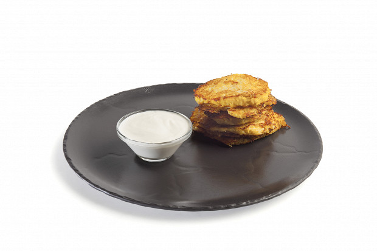

---
image: ../pics/draniki.jpg
---
# Драники

###### Ингредиенты

* картофель 600 г
* куриное яйцо 2 шт
* молоко 30 мл
* мука 20 г
* соль, перец по вкусу
* сметана для подачи

#### Приготовление

Картофель очистить и натереть на мелкой терке, добавить соль, отжать сок. К картофелю добавить яйца, молоко и муку, тщательно перемешать. Сразу же начать обжаривать на раскаленной сковороде с обеих сторон.  
Готовые драники выложить на бумажные полотенца, чтобы избавить от лишнего жира. Подавать со сметаной.

*eda.ru*