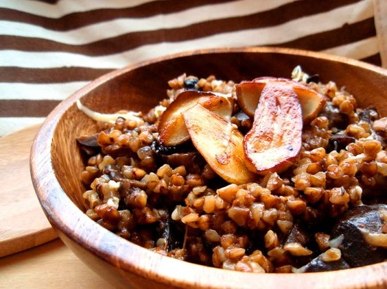

---
image: ../pics/de73acf446ad2970bf197624b9eeb46c.jpg
---
# Гречотто \(гречка приготовленная по методу ризотто\)

Название этого блюда происходит от всем известного "ризотто", только в качестве основного компонента используется не рис, а гречка.
