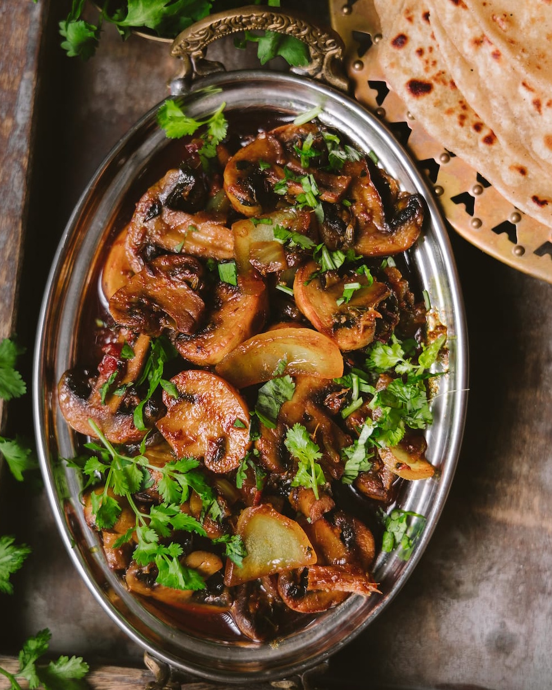

# Пряные жареные грибы

###### Ингредиенты

* грибы 500 г
* 1 помидор
* имбирь
* чеснок 3 зубчика
* семена зиры ½ ч л
* семена фенхеля ½ ч л
* палочка корицы
* гвоздика 3-4 шт
* пажитник 2 ст л
* молотый кумин ¼ ч л
* молотый кориандр ¼ ч л
* молотый чили ¼ ч л
* молотый фенхель ¼ ч л
* соль
* растительное масло 4 ст л
* куркума ½ ч л
* кинза для украшения

#### Приготовление

Разрезать грибы пополам, большие - на четвертинки. Мелко нарезать помидор и чеснок. 

В сковороде разогреть 2 столовые ложки масла, когда она нагреется, выложить грибы слоями, не слишком сильно их перемешивая, обжарить до слегка золотисто-коричневого цвета, снять со сковороды.

В ту же сковороду налить оставшееся масло и добавить все целые специи. Прогреть несколько секунд, затем добавить чеснок и имбирь, помешивать 1 минуту, приправить солью и добавить молотые специи, кроме пажитника, перемешать и готовить 2 минуты. Добавить помидор и готовить еще 2 минуты.

Затем добавить жареные грибы, перемешать и прогреть еще немного. Выправить на соль. В конце добавить пажитник и украсить нарезанной кинзой.

Подавать с лепешкой.

*ig: playfulcooking*
