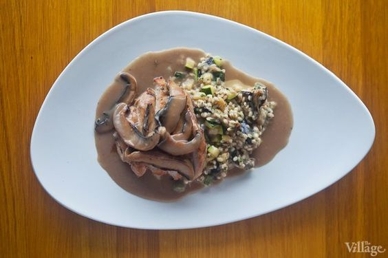

---
image: ../pics/9d665af0b56c10274850ca26750c5c45.jpg
---
# Перлотто \(ризотто из перловой крупы\)

#### Ингредиенты:

* Перловка 200 г \(за 12 часов залить перловку водой\)
* Сливки 60 г
* Масло растительное 50г
* Зелень \(тимьян и петрушка\)
* Перец
* Соль
* Масло сливочное 60 г
* Лук-шалот 40 г
* Сыр пармезан 40 г
* Вино белое 60 г
* Куриный бульон 160 г

Перловку промыть, залить водой и оставить замачиваться на 12 часов, предварительно убрав в холодильник.

Нашинковать лук-шалот и обжарить его на растительном масле до золотистого цвета. Затем добавить туда перловку и влить белое вино. После того, как выпарится немного жидкости, добавить предварительно приготовленный горячий куриный бульон, тёртый пармезан и, в самом конце, сливочное масло. В течение 7–10 минут постоянно помешивать: перловку нельзя оставлять ни на миг. Снять с огня, добавить свежий нашинкованный тимьян и петрушку. Добавить сливки, соль, перец и зелень по вкусу.

*the-village.ru*
