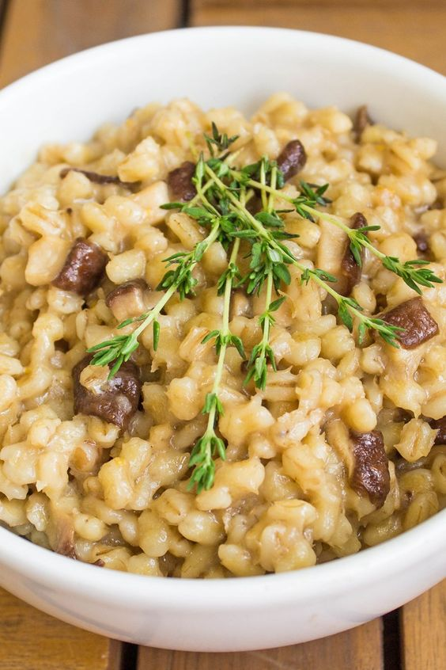

---
image: ../pics/1487861ff8c9628b209a0ac66f9eb49c.jpg
---
# Перловая каша с белыми грибами

#### Ингредиенты

* Грибы белые — 120 г
* Крупа перловая \(отварная\) — 100 г
* Лук-шалот — 50 г
* Листья шалфея — 5 г
* Белое вино — 20 г
* Масло сливочное — 20 г
* Масло оливковое — 20 г
* Сливки — 20 г
* Куриный бульон — 150 г
* Сыр пармезан — 20 г
* Спаржа зелёная — 30 г
* Соль и перец — по вкусу

#### Приготовление

В сотейнике на оливковом масле слегка обжарить лук шалот, шалфей и спаржу, нарезанные небольшим кубиком. Добавить белые грибы, порезанные крупным кубиком, и всё обжарить. Вмешать белое вино, затем положить отварную перловую крупу, добавить куриный бульон и сливки. Пропарить до состояния каши, затем добавить сливочное масло и сыр пармезан и перемешать. Посолить и поперчить по вкусу — каша готова.

*the-village.ru*
