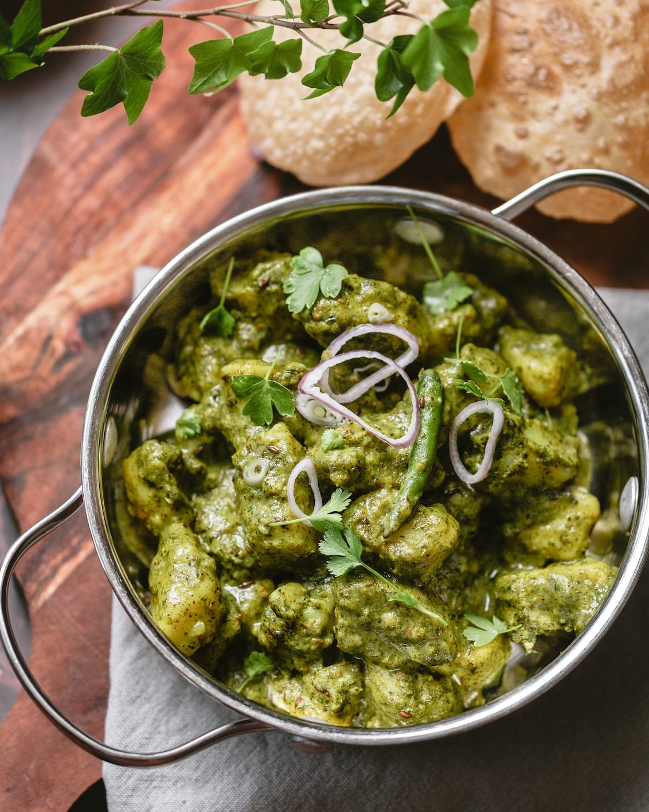

# Pudina Aloo \| Карри из картофеля с мятой

###### Ингредиенты

* картофель 500 г
* свежая мята 120 г
* свежая кинза 49 г
* йогурт 200 г
* семена зиры 1 ч л
* зира молотая 1 ч л
* хлопья чили
* гарам масала ½ ч л
* куркума ½ ч л
* растительное масло 1 ст л
* соль 1 ст л
* мука idealmjöl 1 ст л

#### Приготовление

Отварить картофель с 1 столовой ложкой соли до мягкости, слить воду и остудить. Очистить и нарезать большими кубиками.

Разделить травы на листья и стебли, стебли выбросить. В блендере приготовить пюре из листьев с небольшим количеством воды.

В сковороде разогреть масло на среднем огне, прогреть семена зиры. Добавить картофель, куркуму, хлопья чили и молотую зиру, перемешать и готовить 2 минуты. Добавить пюре из мяты и кинзы. Посыпать гарам масалой и варить на медленном огне 5 минут. Добавить йогурт, смешанный с небольшим количеством муки, и перемешать. Накрыть кастрюлю крышкой и готовить 1 минуту. Выправить на соль.

Подавать с лепешками.

*ig: playfulcooking*
