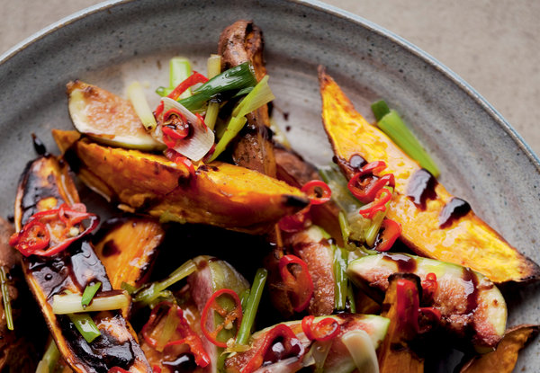

---
image: ../pics/sweet-potato-fig.jpg
---
# Батат с инжиром

###### Ингредиенты

* батат 500 г
* оливковое масло
* бальзамический уксус 20 мл
* сахарная пудра 10 г
* свежий инжир 150 г
* козий сыр 80 г
* соль, черный перец

#### Приготовление

Разогреть духовку до 220С конвекция. Вымыть батат, разрезать его на длинные дольки. Смешать с оливковым маслом, солью, перцем.

Выложить дольки кожей вниз на противень и готовить 25 минут, до мягкости. Вынуть из духовки, остудить.

Чтобы приготовить бальзамический соус, поместить бальзамический уксус и сахар в сотейник. Довести до кипения, затем убавить огонь и варить до загустения. Обязательно снять сотейник с огня, когда уксус все еще будет жиже меда; он продолжит густеть по мере остывания. Добавить каплю воды перед подачей, если он станет слишком густым.

Выложить батат на сервировочное блюдо. Разложить инжир между дольками, а затем полить бальзамическим уксусом. раскрошить сверху сыр, украсить зеленью.

*Yotam Ottolenghi, "Jerusalem"*
