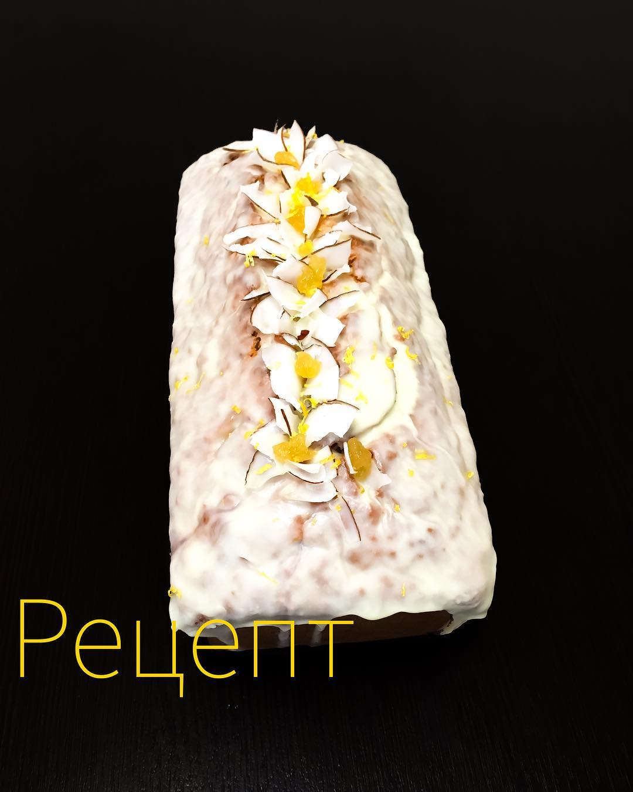

# Бананово-кокосовый кекс

#### Ингредиенты

на форму 30 см

* 3 банана (450гр)
* 200гр размягченного сливочного масла
* 150гр тростникового сахара
* щепотка соли
* 4яйца
* цедра 1 лимона
* 400гр муки
* 2чл разрыхлителя
* 125гр кокосового молока
* 100гр кокосовой стружки

#### Приготовление

Очищенные бананы размять вилкой.  
Масло смешать с сахаром и солью до кремообразного состояния.  
По очереди добавить яйца, бананы, лимонную цедру и кокосовое молоко.  
К этой смеси добавить муку с разрыхлителем и кокосовой стружкой.  
Выложить тесто в смазанную маслом форму и выпекать 20-30 мин до сухой лучины.

*@foodedlife*