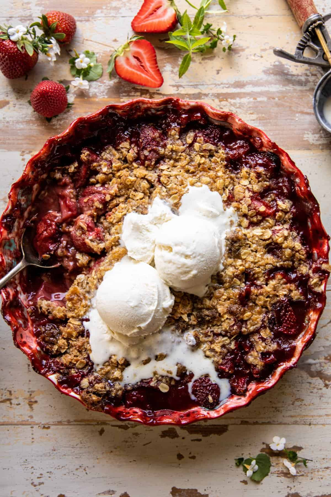

# Клубничный крамбл с бурбоном \| Strawberry Bourbon Crisp

#### Ингредиенты:

* 864 г свежей или замороженной клубники, нарезанной ломтиками (около 3 фунтов)
* 170 г густого клубничного джема
* 2 столовые ложки кленового сиропа
* 1 столовая ложка кукурузного крахмала
* 0,5 чайной ложки корицы
* 3 столовые ложки бурбона (по желанию)
* 2 чайные ложки ванильного экстракта

**для крамбла**

* 125 г муки общего назначения
* 40 г овсяных хлопьев
* 2 столовые ложки коричневого сахара
* 1 чайная ложка корицы
* 1/4 чайной ложки кошерной соли
* 12 столовых ложек холодного соленого сливочного масла, нарезанного кубиками
* 4 столовые ложки кленового сиропа

#### Приготовление:

Разогреть духовку до 180°С.  

В большой миске смешать клубнику, клубничный джем, кленовый сироп, кукурузный крахмал, корицу, бурбон и ваниль. Выложить фрукты в форму для выпечки диаметром 25-30 см.  
Для крамбла смешать в миске овсяные хлопья, муку, коричневый сахар, корицу и соль. Добавить 8 столовых ложек сливочного масла и смешать в крошку.  
Распределить по клубнике, накрыть фольгой и запекать 30 минут. Снять фольгу и равномерно распределить сверху 4 столовые ложки сливочного масла, сбрызнуть кленовым сиропом. Запечь еще 15-20 минут, не накрывая.  
Слегка остудить, подавать с мороженым.  

*[https://www.halfbakedharvest.com/strawberry-bourbon-crisp](https://www.halfbakedharvest.com/strawberry-bourbon-crisp/)*
