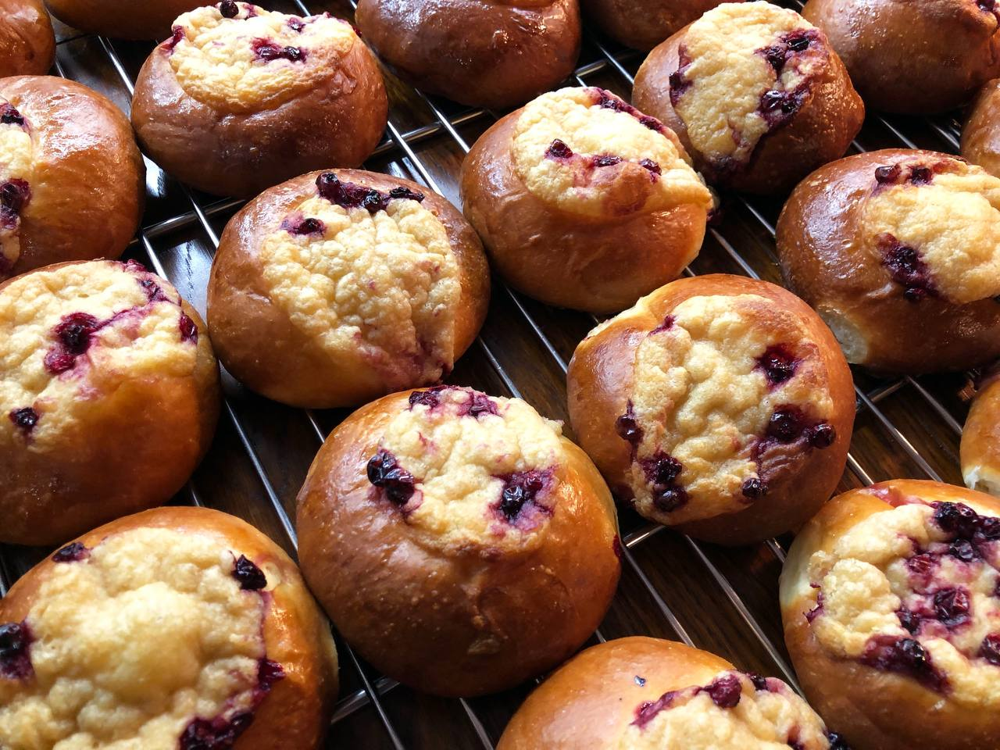

# Шанежки с толоконной поливой и брусникой

#### Ингредиенты

**для опары:**

* Молоко 290 г
* Дрожжи свежие 7 г
* Мука 225 г

**для теста:**

* Желток куриный 2 шт
* Сахар 50 г
* Соль 8 г
* Масло сливочное 75 г
* Опара

**для поливы:**

* Толокно 50 г
* Масло сливочное 40 г
* Молоко 50 г
* Сметана 150 г
* Соль 3 г
* Сахар — по вкусу
* Брусника (или другая ягода) — по вкусу
* Яйцо — для смазки

#### Приготовление

Смешать  все  ингредиенты и поставить опару подходить в тёплое место на 12 часов.  
Замесить тесто, дать подняться, обмять через 1 час.  
Когда тесто вновь подойдёт, развесить по 70 г.  
Сформовать шарики и поставить  расставаться.  
Растопить сливочное масло, добавить в него толокно и обжарить до орехового аромата, затем добавить молоко и сметану, уварить до густого состояния. Довести до вкуса солью и сахаром, остудить и добавить ягоды.  
Когда шарики  теста  увеличатся в размере в два раза, слегка примять их и выложить толоконную массу с ягодами. Смазать взбитым яйцом и выпекать при 170°С 15–20 мин

*Рецепт шеф-повара Павла Клепикова*