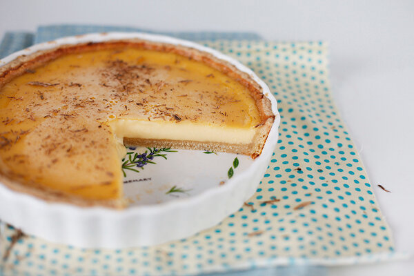

# Лимонно-медовый тарт

#### Ингредиенты:

на форму 20 - 23 см

**тесто:**

* 200г муки
* 100г масла
* 50г сахара
* цедра 1 лимона
* 1 яйцо
* 2 ст.л. лимонного сока

**начинка:**

* 200мл лимонного сока \(3 лимона\)
* цедра 2-х лимонов
* 2 яйца
* 150г густого меда
* 200г жирной сметаны

для посыпки грецкие орехи или медовый тархун

#### Приготовление:

Приготовить и выпечь основу для тарта

Пока печется, приготовить заливку. Добавить в сок с цедрой и медом два яйца, хорошо размешать и процедить, смешать со сметаной. В горячую основу вылить заливку и вернуть в духовку, уменьшив температуру до 160С. Пирог готов, когда заливка похожа на желе. На это уходит около получаса.

[_https://chadeyka.livejournal.com/245374.html_](https://chadeyka.livejournal.com/245374.html)

