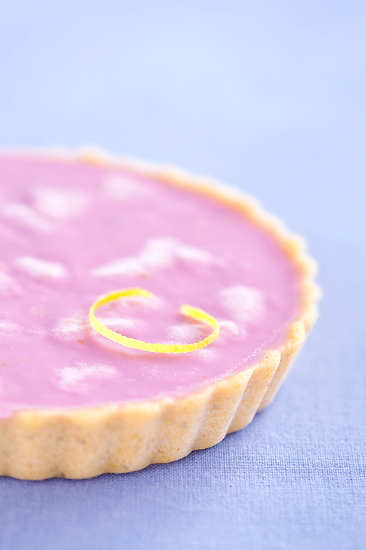

# Тарт с белым шоколадом, лимоном и лавандой

#### Ингредиенты:

на форму 16 см

* основа для тарта \(с лавандой\)
* 150 г белого шоколада 
* 50 мл 33% сливок 
* 1\3 ч. л. лаванды 
* цедра и мякоть 1 лимона 

#### Приготовление:

Приготовить начинку. Цедру \(только желтую часть\) измельчить. Мякоть нарезать кусочками. 

Сливки довести до кипения, добавить лаванду, накрыть, дать настояться, процедить, снова подогреть. 

Шоколад растопить на водяной бане, добавить подогретые сливки, тщательно перемешать, добавить лимонную цедру, перемешать. 

Разложить на основе для тарта кусочки лимона, залить шоколадной начинкой, убрать в холодильник до полного застывания.

[_https://laperla-foto.livejournal.com/122531.html_](https://laperla-foto.livejournal.com/122531.html)

