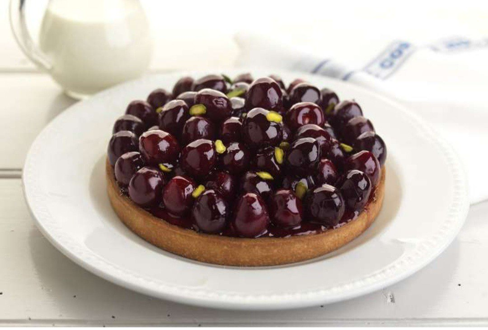

# ​​Тарт с вишней и миндалём

#### Ингредиенты:

**для теста:**

* сливочное масло 125 г
* сахар 50 г
* лимонная цедра 1 шт.
* яйцо 1 шт.
* ванильный экстракт по вкусу
* мука 250 г
* соль 5 гр

**для начинки:**

* вишня 500 г
* красное вино \(Мерло\) 250 мл
* сахар 150 г
* ваниль 1 стручок

**для крема:**

* сливочное масло 115 г
* сахар 115 г
* лимонная цедра 1/2 шт.
* ванильный экстракт 5 мл
* яйца 2 шт.
* мука 30 г
* молотый миндаль 115 г
* бренди 20 мл

**для оформления:**

* рубленые фисташки 10 шт.

#### Приготовление:

В большой миске смешайте сливочное масло, сахар и лимонную цедру до консистенции бледного цвета. Постепенно добавьте яйцо и ваниль.

Просейте муку и соль. Добавьте в смесь. Размешайте. Охладите до 30 минут.

Удалите косточки из вишни. 

Нагрейте вино в сотейнике на медленном огне. В отдельной кастрюле нагрейте сахар до карамельного цвета. Влейте к сахару половину вина. Доведите до кипения. Постепенно добавьте оставшееся вино. Добавьте ванильный стручок. Варите до легкой густоты. Затем добавьте вишню и готовьте на медленном огне в течение 4 минут.

Удалите вишню. Продолжайте готовить до густой сиропообразной массы. Остудите.

Тесто выложите в форму для запекания. Разровняйте. Накройте пищевой пленкой и охладите в течение 15 минут. Удалите пленку. Отправьте в духовку при 200 градусах на 15–20 минут. Уменьшите температуру в духовке до 160 градусов. 

Приготовьте крем. В большой миске измельчите вместе сливочное масло, сахар, лимонную цедру и ванильный экстракт до смеси бледного цвета. Постепенно добавьте яйца. Процедите муку и молотый миндаль. Добавьте к влажным ингредиентам. Добавьте бренди и перемешайте до однородной массы. Разровняйте с помощью ложки поверх теста. Отправьте в духовку на 20–25 минут.

Вишню выложите поверх миндального крема. Полейте сиропом.

Украсьте пирог рублеными фисташками.

[_https://t.me/ktchn\_story_](https://t.me/ktchn_story)

